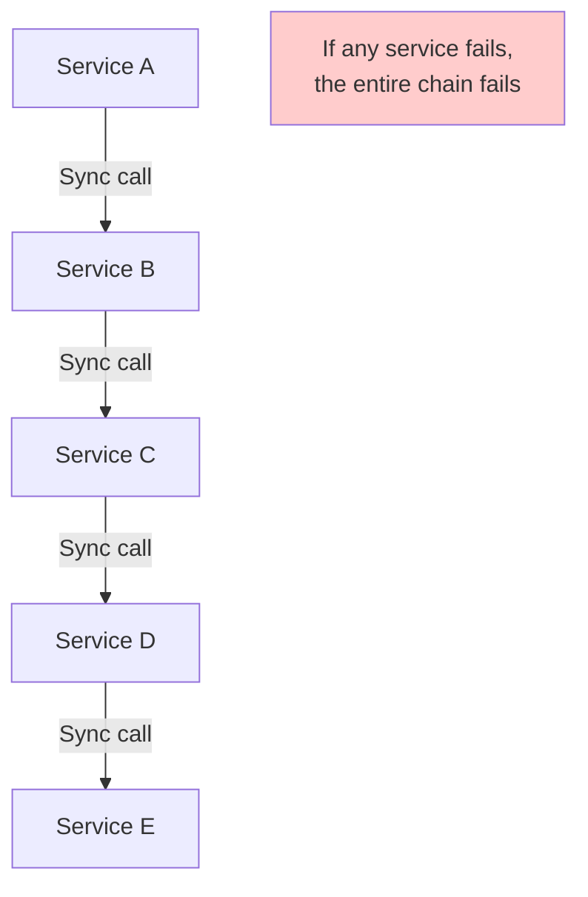
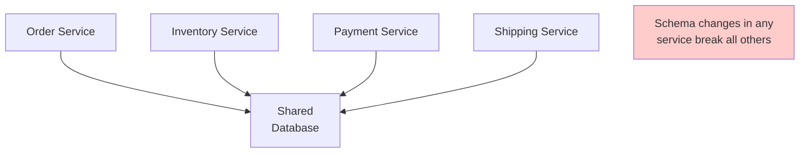
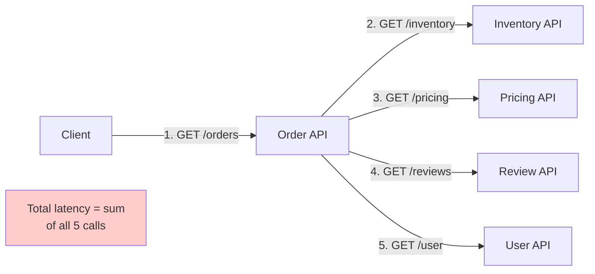

# Anti-Patterns

Common architecture mistakes that look reasonable but cause serious problems.

---

## Distributed Monolith

Microservices that are deployed independently but remain tightly coupled in operation.



**Symptoms:**
- Failure in one service cascades to all others
- Cannot scale services independently
- Must deploy all services together
- Debugging requires tracing through 5+ services
- "Microservices" that are always developed, tested, and deployed as a unit

**Root causes:**
- Poorly defined service boundaries
- Excessive synchronous REST calls between services
- Shared libraries with breaking changes
- Shared database (see below)
- Conway's Law — teams structured by layers, not domains

**How to fix:**
1. Define clear bounded contexts (DDD)
2. Use async messaging instead of synchronous calls
3. Implement circuit breakers for remaining sync calls
4. Enable independent deployability as a first-class requirement
5. Measure: Can Service A be deployed without deploying Service B? If not, it's a distributed monolith.

---

## Shared Database Anti-Pattern

Multiple microservices directly access and modify the same database schema.



**Why it's seductive:**
- "It's easier to just query the same tables"
- "We need real-time consistency"
- "We don't have time to set up APIs"

**Consequences:**
- Schema changes break other services
- Cannot scale services independently
- Database becomes the bottleneck
- Technology lock-in (everyone must use the same DB)
- "Postpones the hardest architectural decision: who owns the meaning of the data"

**How to fix:**
1. Service-owned data with event-driven integration (CDC, outbox)
2. Progressive strangler migration — extract one service at a time
3. DDD bounded contexts with explicit data ownership
4. Accept eventual consistency for cross-service data

**Migration path:**
```
Shared DB → API layer over shared DB → Event-driven sync → Database per Service
```

---

## Synchronous Chains

Over-reliance on synchronous REST/gRPC calls for inter-service communication.



**Problems:**
- **Tight temporal coupling:** All services must be up simultaneously
- **Cascading failures:** One slow service slows everything
- **Latency multiplication:** 5 services × 100ms each = 500ms minimum
- **Resource waste:** Threads blocked waiting for responses

**How to fix:**
1. Event-driven async messaging (pub/sub, queues)
2. Saga pattern for distributed transactions
3. API Composition for simple cross-service queries
4. CQRS with read models for query-heavy workloads
5. Accept eventual consistency with compensation logic

---

## Other Common Anti-Patterns

### Over-Decomposition

Too many fine-grained services. Operational overhead exceeds benefits.

**Symptoms:**
- More time managing infrastructure than writing features
- Services with <100 lines of code
- "Nano-services" that do one trivial thing

**Fix:** Merge related services. Aim for "right-sized" services that a team can own.

### Big-Bang Rewrite

Attempting to rewrite an entire system from scratch at once.

**Why it fails:**
- Requirements change during rewrite
- No feedback loop until the end
- Business can't wait 2 years for new system
- Knowledge in the old system is lost

**Fix:** Strangler Fig pattern — incremental migration.

### Golden Hammer

Using the same technology/pattern for every problem.

**Symptoms:**
- "We use Kafka for everything"
- "Every service must be a microservice"
- "We need event sourcing for this simple CRUD app"

**Fix:** Match the tool to the problem. Start simple, add complexity as needed.

### Configuration Hardcoding

Configuration values embedded in code.

**Consequences:**
- Requires redeployment for configuration changes
- Different environments need different code
- Secrets potentially exposed in source control

**Fix:** Environment variables, config files, secret managers (Vault, AWS Secrets Manager).

---

## Prevention Checklist

Before adopting a pattern, ask:

- [ ] **Do we have the problem this pattern solves?**
- [ ] **Is our team experienced enough to maintain this complexity?**
- [ ] **Can we measure the benefit?**
- [ ] **Is there a simpler alternative?**
- [ ] **Can we reverse this decision if it doesn't work?**

---

## Crosslinks

- [[Decomposition Patterns]] — How to properly decompose (vs distributed monolith)
- [[Communication Patterns]] — How to communicate properly (vs synchronous chains)
- [[Data Patterns]] — How to manage data properly (vs shared database)
- [[Deployment Patterns]] — How to deploy properly (vs big-bang)
- [[A Philosophy of Software Design]] — Complexity management principles
