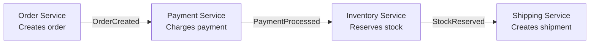
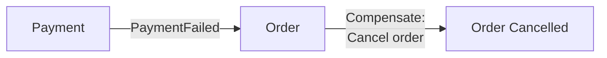
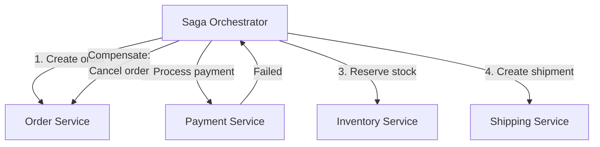
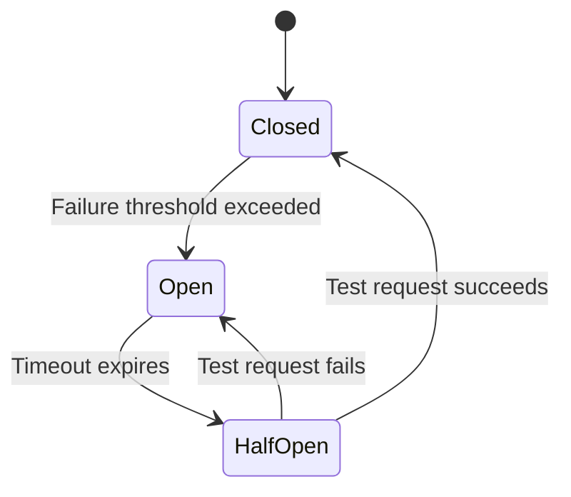
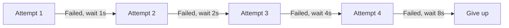
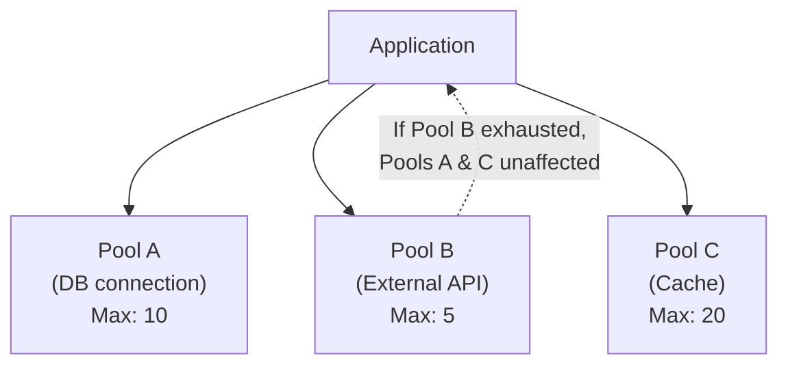
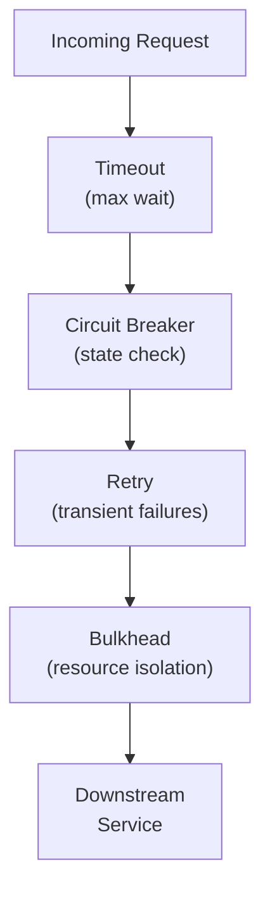

# Communication Patterns

How services talk to each other reliably in distributed systems.

---

## Saga Pattern

Implements business transactions spanning multiple services using local transactions with compensating transactions for rollback.

### Choreography Variant

Each service publishes domain events that trigger the next step. No central coordinator.



**Failure handling:**


**Pros:** Decoupled, no single point of failure, simple infrastructure.
**Cons:** Hard to understand flow, hard to add new steps, debugging is complex.

### Orchestration Variant

A central orchestrator directs participants' local transactions.



**Pros:** Clear workflow, easier to modify, easier to debug.
**Cons:** Single point of coupling, orchestrator can become bottleneck.

### When to Use

- Business transactions spanning multiple services with different databases
- When 2PC is not viable or desirable
- When eventual consistency is acceptable

**Real-world:** Netflix (choreography), Uber (orchestration via Cadence/Temporal), Amazon e-commerce

---

## Circuit Breaker

A stateful proxy that monitors failures and prevents an application from repeatedly trying an operation likely to fail.



**Three states:**
- **Closed:** Normal operation. Failures counted. If threshold exceeded → Open.
- **Open:** Fails fast immediately. No calls to downstream. After timeout → Half-Open.
- **Half-Open:** Allows one test request. If succeeds → Closed. If fails → Open.

**Configuration:**
```
Failure threshold: 5 failures in 60 seconds
Timeout: 30 seconds
Half-Open max attempts: 3
```

**When to use:**
- Calling remote services that may be unavailable
- Preventing cascading failures
- Protecting against slow dependencies

**Trade-offs:**
- ✅ Prevents cascading failures
- ✅ Fails fast when service is likely down
- ✅ Allows failing service to recover
- ❌ Need to handle Open state gracefully (fallback, degradation)
- ❌ Threshold tuning is critical

**Real-world:** Netflix Hystrix (pioneered it), Resilience4j (current standard), Istio (infrastructure-level)

---

## Retry with Exponential Backoff

Automatically re-attempts failed operations with increasing wait times.



**Key addition — Jitter:** Add randomness to prevent thundering herd when multiple clients retry simultaneously.

```
Base delay: 1s
Max delay: 30s
Multiplier: 2x
Jitter: random(0, 1) × base_delay
```

**When to use:**
- Transient network failures
- Temporary service unavailability
- Rate limiting responses (HTTP 429)

**Trade-offs:**
- ✅ Handles transient failures automatically
- ❌ Can create DoS against already overloaded services
- ❌ Introduces latency for the caller
- ❌ Retry amplification in cascading scenarios

**Real-world:** AWS SDK (built-in), Google Cloud (automatic), Istio (configurable at infrastructure level)

---

## Bulkhead

Isolates resources per dependency so that failure of one doesn't affect others. Named after ship bulkheads that prevent sinking.



**Implementation approaches:**
- **Thread pool isolation:** Separate thread pools per dependency
- **Semaphore isolation:** Limit concurrent calls per dependency (lighter weight)
- **Process/container isolation:** Separate processes per dependency (strongest isolation)

**When to use:**
- Service depends on multiple downstream services
- Prevent one slow/failing dependency from consuming all resources

**Trade-offs:**
- ✅ Prevents cascade failures across dependencies
- ✅ Maintains availability of unaffected services
- ❌ Over-provisioning needed (resources dedicated but potentially idle)

**Real-world:** Netflix Hystrix, Resilience4j, Istio connection pool limits

---

## Timeout

Sets an upper bound on how long to wait for a response.

**When to use:** Always, when making synchronous remote calls. Without timeouts, threads can block indefinitely.

**The ambiguity problem:** A timeout tells you the caller didn't get a response in time — but the operation may have completed on the remote side. This makes retries risky (potential duplicate operations).

**Best practices:**
- Set connect timeout separate from read timeout
- Use deadline propagation (gRPC carries deadline across all hops)
- Combine with circuit breaker for comprehensive protection

---

## Resilience Stack

The standard combination for distributed systems:



| Pattern | Protects Against |
|---------|-----------------|
| Timeout | Indefinite blocking |
| Circuit Breaker | Cascading failures |
| Retry | Transient failures |
| Bulkhead | Resource exhaustion |

---

## Crosslinks

- [[Data Patterns]] — Saga in context of event-driven architecture
- [[Decomposition Patterns]] — How services are structured before communicating
- [[Anti-Patterns]] — Synchronous Chains (over-reliance on sync communication)
- [[Testing, Chaos Engineering and Observability]] — Testing resilience patterns
