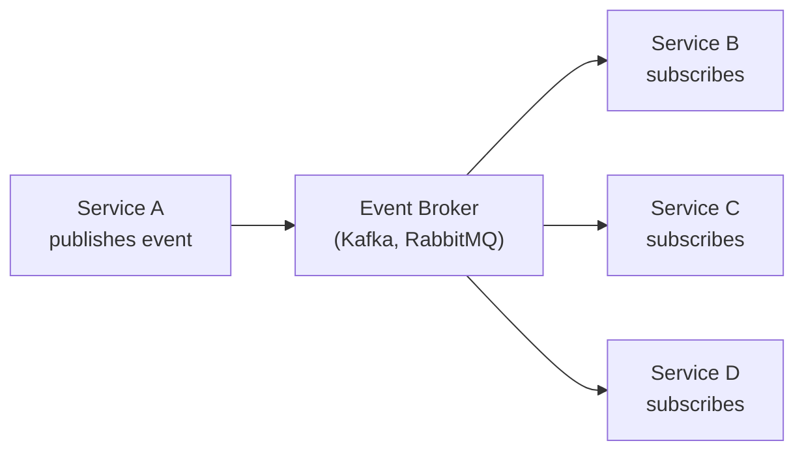
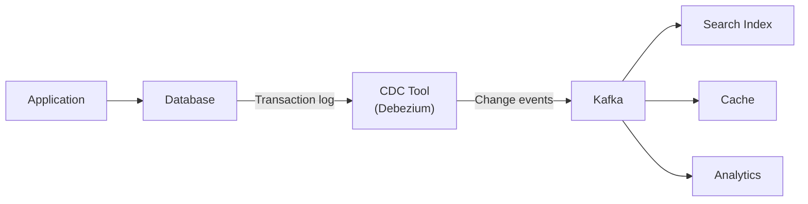
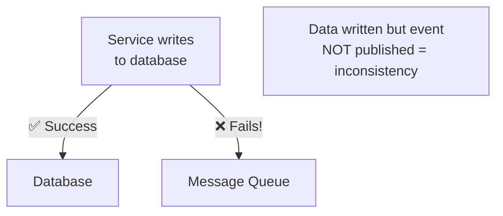
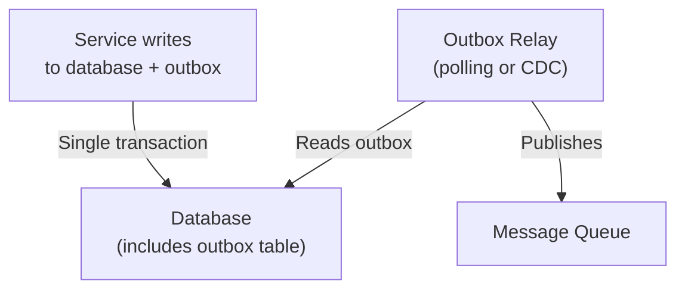
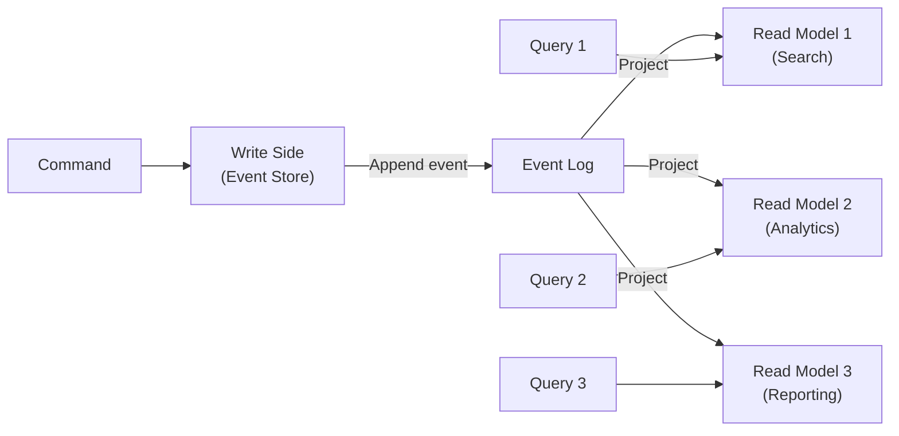

# Data Patterns

How to manage data flow across distributed services reliably.

---

## Event-Driven Architecture (EDA)

Services communicate primarily through events (state changes). Producers publish events; consumers subscribe and react asynchronously.



**Core principle:** Producers don't know about consumers. Events as first-class citizens.

**When to use:**
- Services need to react to state changes in other services
- Loose coupling between services is paramount
- Real-time data processing pipelines
- Multiple consumers of the same event

**Trade-offs:**
- ✅ Loose coupling — producers don't know about consumers
- ✅ Natural scalability — add consumers independently
- ✅ Easy to add new consumers without modifying producers
- ❌ Eventual consistency everywhere
- ❌ Harder to debug and trace request flows
- ❌ Event schema evolution is challenging

**Real-world:** Netflix, Uber (real-time ride matching), LinkedIn (Kafka-based analytics), financial trading

---

## Change Data Capture (CDC)

Detects changes in a database's transaction log and streams them as events to downstream consumers. No application code changes needed.



**How it works:**
1. Application writes to database normally
2. CDC tool reads the database's write-ahead log (WAL, binlog)
3. Changes are captured as events and published to a message broker
4. Downstream consumers react to changes

**Tools:** Debezium (most popular, open-source), AWS DMS, GCP Datastream

**When to use:**
- Real-time data synchronization between systems
- Populating read models, caches, search indexes
- Data replication without modifying application code
- Combined with Outbox Pattern for reliable publishing

**Trade-offs:**
- ✅ Real-time, near-zero latency
- ✅ No application code changes needed
- ✅ Reliable and ordered delivery
- ❌ Tightly coupled to database internals
- ❌ Schema changes can break consumers
- ❌ Requires database replication privileges

**Real-world:** LinkedIn (Kafka Connect), Amazon (Aurora → Redshift), Confluent CDC pipelines

---

## Outbox Pattern

Solves the dual-write problem: writing to a database AND publishing to a message broker atomically.

### The Problem



### The Solution



**How it works:**
1. Application writes business data + event to outbox table in ONE transaction
2. A separate relay process reads the outbox
3. Relay publishes events to message broker
4. Relay marks events as published

**Implementation options:**
- **Polling:** Relay polls outbox table periodically. Simple but adds latency.
- **CDC-based:** Use Debezium to capture outbox changes. Near-zero latency but more infrastructure.

**Trade-offs:**
- ✅ Guarantees atomicity of DB write + event publication
- ✅ Reliable event delivery (at-least-once)
- ✅ Event ordering guaranteed
- ❌ Adds complexity (outbox table, relay process)
- ❌ Requires idempotent consumers (at-least-once delivery)

**Real-world:** Uber (payment events), most Kafka-based microservice architectures, Debezium Outbox Event Router

---

## CQRS + Event Sourcing Combined

The full picture: writes go to an event store, projections build optimized read models.



**When combined with Outbox:**
```
Command → Write to Event Store + Outbox (atomic)
         → Outbox Relay → Kafka
         → Projections → Read Models
```

**Comparison of approaches:**

| Approach | Source of Truth | Consistency | Complexity | Best For |
|----------|----------------|-------------|------------|----------|
| CDC only | Database log | Strong (DB) | Low | Data sync, search indexing |
| CDC + Outbox | Database + Outbox | Strong (DB) | Medium | Reliable event publishing |
| CQRS | Write model | Eventual (reads) | High | Different read/write models |
| Event Sourcing | Event journal | Eventual | Very High | Full audit, temporal queries |
| CQRS + ES + Outbox | Event journal | Eventual | Highest | Full audit + optimized reads |

---

## Dual-Write Problem

The fundamental issue that Outbox Pattern and CDC solve:

**The impossibility:** You cannot atomically write to two different systems (database + message broker) in a distributed system without 2PC.

**Why 2PC is usually not the answer:**
- Locks held across systems during prepare phase
- Coordinator is a single point of failure
- Performance degrades under load
- Most message brokers don't support 2PC

**Solutions ranked by complexity:**
1. **Outbox + Polling** — Simple, some latency
2. **Outbox + CDC** — Near-zero latency, more infrastructure
3. **Transactional Outbox (event sourcing)** — Full audit trail, highest complexity

---

## Crosslinks

- [[Decomposition Patterns]] — CQRS and Event Sourcing as decomposition tools
- [[Communication Patterns]] — Saga pattern uses events for coordination
- [[Deployment Patterns]] — CDC as deployment concern
- [[Designing Data-Intensive Applications]] — Part 11 (Stream Processing) covers CDC deeply
