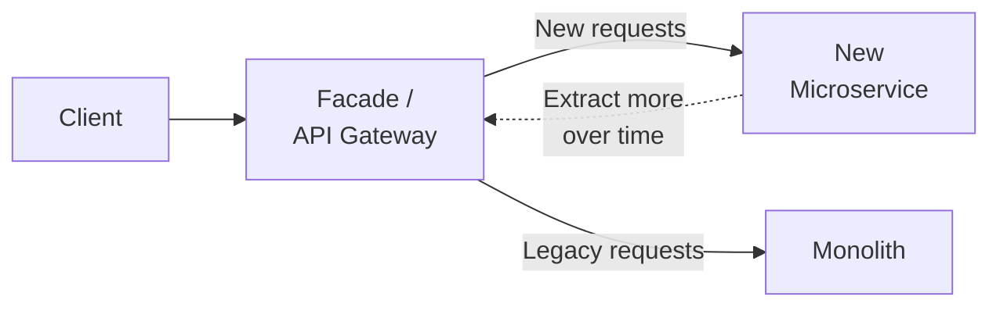
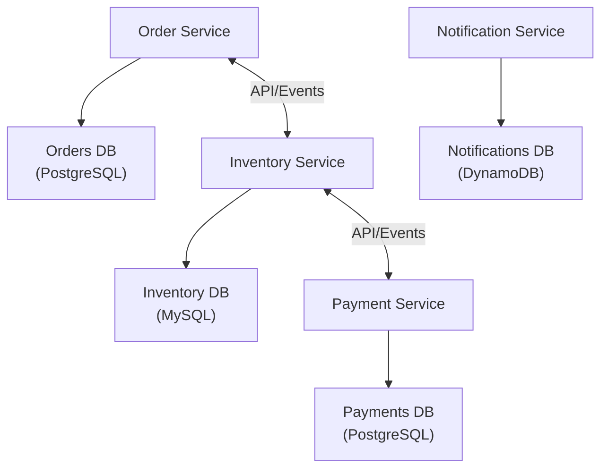
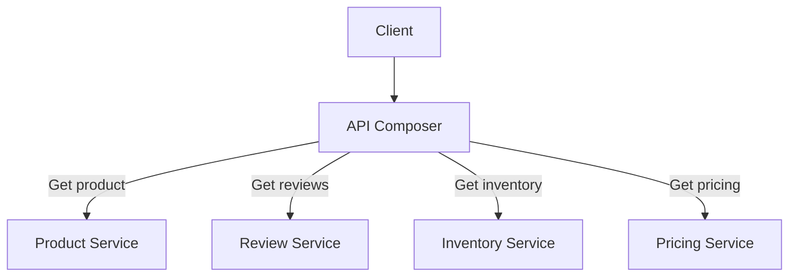
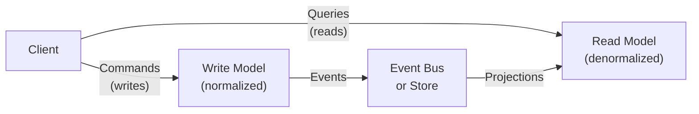
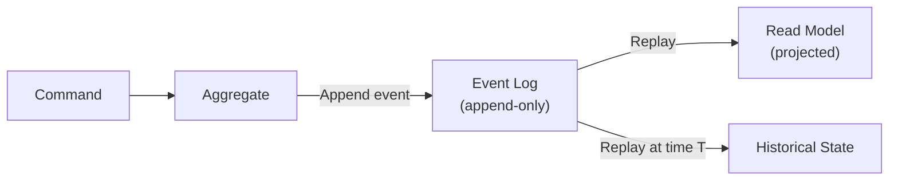

# Decomposition Patterns

How to break a system into manageable, independently deployable pieces.

---

## Strangler Fig Pattern

Incrementally replace a monolith by routing traffic through a facade that gradually shifts requests to new microservices.

**How it works:**
1. Deploy a facade (reverse proxy, API gateway) in front of the monolith
2. Route new features to new microservices
3. Gradually extract existing features from the monolith
4. When all traffic goes to microservices, decommission the monolith

**When to use:**
- Migrating from monolith to microservices
- Legacy systems too risky to rewrite at once
- When you need incremental delivery and rollback

**Trade-offs:**
- ✅ Low risk — gradual, reversible at each step
- ✅ Business continuity maintained during migration
- ❌ Maintaining two systems simultaneously
- ❌ Can take years for large monoliths (Netflix took 7 years)

**Real-world:** Netflix (monolith → hundreds of microservices over 7 years), Amazon (2001), Shopify (Rails monolith extraction)

---

## Database per Service

Each microservice owns its own private database. Services communicate via APIs/events, not shared tables.

**When to use:**
- Services need independent scaling and technology choices
- Different services have different data storage needs
- You want to prevent tight coupling through shared databases

**Trade-offs:**
- ✅ Loose coupling — services evolve independently
- ✅ Technology freedom (polyglot persistence)
- ✅ Independent deployment and scaling
- ❌ Cross-service queries become very hard
- ❌ Data consistency across services is complex
- ❌ Reporting/analytics requires additional infrastructure

**Real-world:** Uber (MySQL, Redis, Cassandra, PostgreSQL across services), most major tech companies

---

## API Composition

An aggregator service invokes multiple microservices, retrieves their data, and performs an in-memory join before returning the combined result.

**When to use:**
- Query data that spans 2-4 services
- Simple join queries with acceptable eventual consistency
- As a simpler alternative to CQRS

**Trade-offs:**
- ✅ Simple to implement
- ✅ No additional data stores needed
- ❌ Performance issues with many service calls (N+1 problem)
- ❌ If one service is down, the entire query fails
- ❌ Does not scale well with number of participating services

**Real-world:** E-commerce product pages, customer dashboards

---

## CQRS (Command Query Responsibility Segregation)

Separate read and write operations into different models. Commands update a write model; queries read from a separate, optimized read model.

**When to use:**
- Read and write workloads have very different scaling needs
- Read models need to be denormalized differently
- Multiple read models needed for different query patterns
- Combined with Event Sourcing for full audit trail

**Trade-offs:**
- ✅ Independent scaling of reads vs writes
- ✅ Optimized read models (denormalized views)
- ❌ Eventual consistency between write and read models
- ❌ Significant increase in complexity
- ❌ Overkill for simple CRUD applications

**Real-world:** LinkedIn (feed generation vs post creation), financial systems, online gaming

---

## Event Sourcing

Instead of storing current state, all state changes are stored as an immutable sequence of events. Current state is derived by replaying events.

**When to use:**
- Complete audit trail of all changes required
- Need to reconstruct state at any point in time
- Financial/audit-critical domains
- Event-driven architectures needing atomicity between DB + message broker

**Trade-offs:**
- ✅ Complete, immutable audit log
- ✅ Temporal queries (state at any point in time)
- ✅ Enables event replay for debugging and recovery
- ❌ Unfamiliar programming model (steep learning curve)
- ❌ Requires CQRS for efficient queries
- ❌ Schema evolution of events is challenging

**Real-world:** Banking/financial systems, Amazon order lifecycle, EventStoreDB, Kafka (append-only log)

---

## When to Use Which

| Scenario | Pattern |
|----------|---------|
| Migrating from monolith | Strangler Fig |
| Services need different databases | Database per Service |
| Simple cross-service queries (2-4 services) | API Composition |
| Read/write scaling differs significantly | CQRS |
| Full audit trail required | Event Sourcing |
| Audit trail + optimized reads | CQRS + Event Sourcing |
| Simple CRUD, single service | None — keep it simple |

---

## Crosslinks

- [[Communication Patterns]] — How decomposed services talk to each other
- [[Data Patterns]] — Event Sourcing and CQRS in detail
- [[Anti-Patterns]] — Distributed Monolith (bad decomposition)
- [[Designing Data-Intensive Applications]] — Theory behind these patterns
