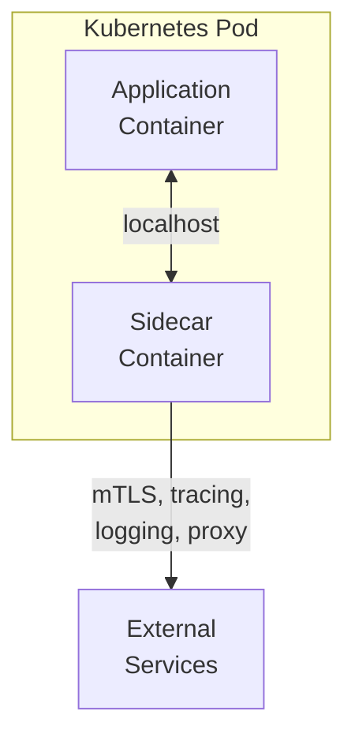
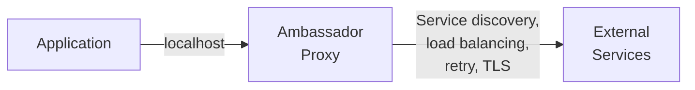
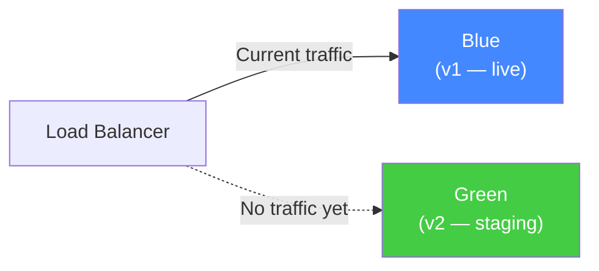
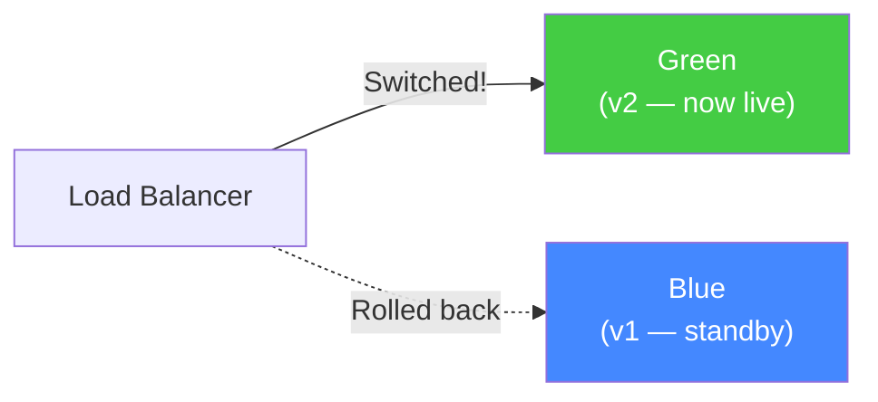
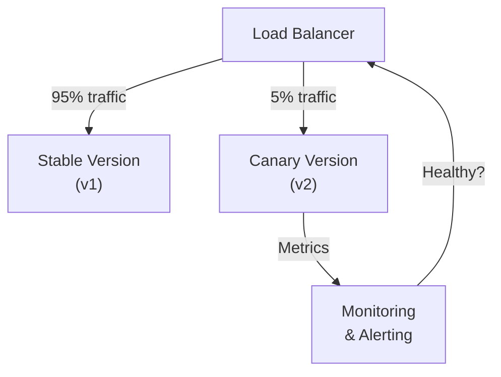
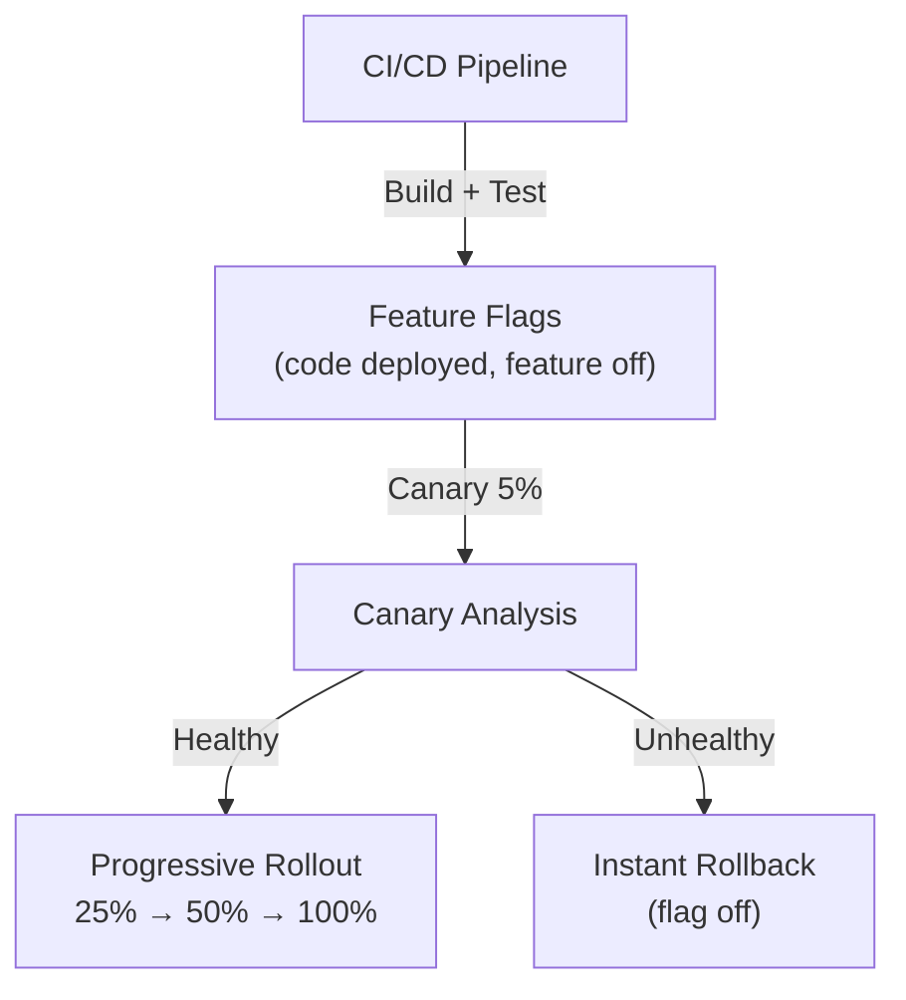

# Deployment Patterns

How to release changes safely and efficiently in cloud environments.

---

## Sidecar Pattern

Deploy an auxiliary container alongside the main application container. The sidecar handles cross-cutting concerns without modifying application code.



**Common sidecar responsibilities:**
- Logging and monitoring collection
- Network proxy (Envoy for service mesh)
- TLS termination and mTLS
- Configuration management
- Health checking

**When to use:**
- Consistent logging/tracing/monitoring across services
- Adding network proxy capabilities (Istio)
- Security concerns (mTLS, auth) without app changes
- Separating operational concerns from business logic

**Trade-offs:**
- ✅ Language-agnostic — works with any application
- ✅ Consistent cross-cutting behavior across fleet
- ✅ Managed and updated independently
- ❌ Resource overhead (CPU/memory per sidecar)
- ❌ Increased pod startup time

**Real-world:** Istio (Envoy sidecar), Datadog (agent sidecar), Linkerd (lightweight proxy)

---

## Ambassador Pattern

A proxy container that handles all outbound network communication. Simplifies external API interactions, service discovery, and routing.



**When to use:**
- Services need to connect to external APIs/services
- Centralize service discovery and load balancing
- Consistent retry/circuit breaker at infrastructure level

**Trade-offs:**
- ✅ Simplifies application networking code
- ✅ Can be updated without changing application
- ❌ Adds latency (additional network hop)
- ❌ Configuration complexity for routing rules

**Real-world:** Cloudflare (edge routing), Kubernetes Ambassador (Envoy), cloud load balancers

---

## Blue-Green Deployment

Two identical production environments. Traffic switches atomically between them.





**When to use:**
- Zero-downtime deployments required
- Instant rollback is critical
- Applications that can't tolerate partial deployments

**Trade-offs:**
- ✅ Zero downtime deployment
- ✅ Instant rollback (switch traffic back)
- ✅ Simple to understand
- ❌ Requires double the infrastructure
- ❌ Database schema migrations complex (must be backward-compatible)

**Real-world:** Heroku, AWS Elastic Beanstalk, Kubernetes (two Deployments + Service switch)

---

## Canary Deployment

Gradually roll out changes to a small subset of users (1-5%) before full deployment.



**Rollout strategy:**
1. Deploy canary with 5% traffic
2. Monitor error rates, latency, business metrics
3. If healthy → increase to 25%, 50%, 100%
4. If unhealthy → rollback immediately

**When to use:**
- Validate changes in production with minimal risk
- High-traffic services where full deployment is risky
- Robust monitoring and metrics infrastructure exists

**Trade-offs:**
- ✅ Minimal blast radius for failures
- ✅ Data-driven rollout decisions
- ❌ Requires sophisticated traffic splitting
- ❌ Longer deployment cycles

**Real-world:** Google (pioneered it), Netflix (automated canary analysis), Kubernetes + Istio (weighted traffic splitting)

---

## Feature Flags (Feature Toggles)

Deploy code without releasing features. Features wrapped in conditional checks controlled by configuration flags.

```python
# Code is deployed but feature is off
if feature_flags.is_enabled("new-checkout-flow"):
    return new_checkout(order)
else:
    return legacy_checkout(order)
```

**Use cases:**
- **Gradual rollout:** Enable for 1% → 10% → 100% of users
- **Kill switch:** Instantly disable a broken feature
- **A/B testing:** Route users to different implementations
- **Infrastructure migration:** Toggle between old and new backends

**When to use:**
- Decouple deployment from feature release
- Instant rollback of features
- Safe infrastructure migration
- Experimentation and A/B testing

**Trade-offs:**
- ✅ Deploy code continuously, release features on demand
- ✅ Instant rollback (toggle off)
- ❌ Technical debt from accumulated flags
- ❌ Testing complexity (2^n flag combinations)

**Real-world:** Facebook/Meta (extensive use), Netflix, LaunchDarkly, Atlassian

---

## Deployment Pattern Comparison

| Pattern | Downtime | Rollback Speed | Infrastructure Cost | Complexity |
|---------|----------|---------------|--------------------|-----------| 
| Blue-Green | Zero | Instant | 2x | Low |
| Canary | Zero | Fast | 1.1x | Medium |
| Rolling Update | Zero | Minutes | 1x | Low |
| Feature Flags | Zero | Instant (feature) | 1x | Low-Medium |
| Sidecar | N/A (infra) | N/A | +10-20% per pod | Medium |

---

## Progressive Delivery

Modern deployment combines multiple patterns:



**Tools:** Argo Rollouts (Kubernetes), Flagger (Kubernetes), LaunchDarkly (feature flags), Spinnaker (multi-cloud CD)

---

## Crosslinks

- [[Multi-Region Kubernetes]] — Kubernetes-specific deployment patterns
- [[Multi-Region Applications]] — Blue-green and canary across regions
- [[Decomposition Patterns]] — Strangler Fig as migration deployment pattern
- [[Anti-Patterns]] — Deployment anti-patterns (big-bang releases)
