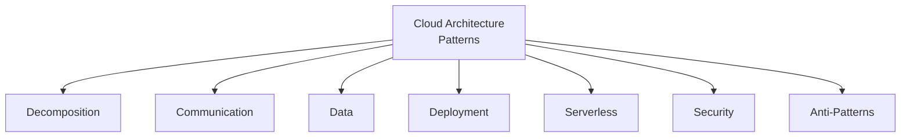
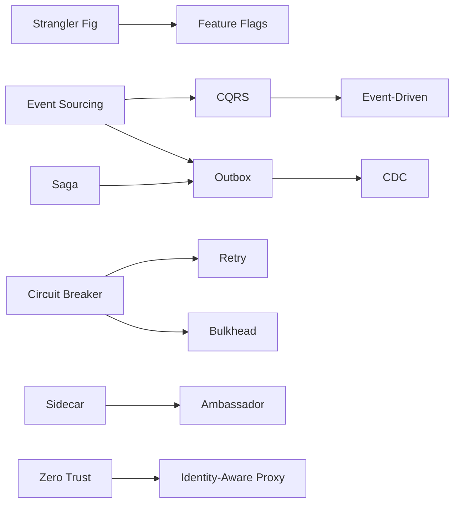
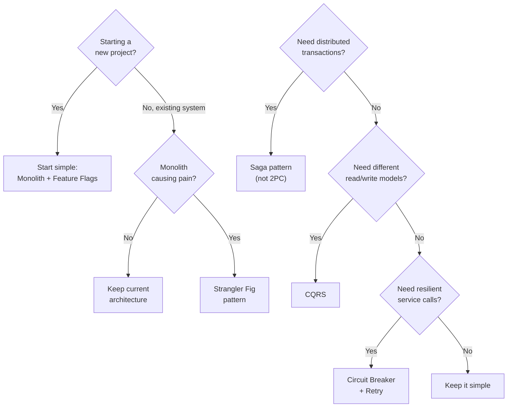

# Cloud Architecture Patterns

**What it is:** Reusable solutions to common problems in cloud application design. Each pattern addresses a specific challenge with proven trade-offs.

**Why it matters:** Patterns prevent reinventing the wheel. They encode lessons learned from thousands of production systems.

**When to use them:** When you face a recurring design problem. Don't adopt patterns preemptively — add complexity only when the problem exists.

---

## Pattern Categories

---

## Decomposition Patterns

How to break a system into manageable pieces.

- [[Decomposition Patterns]] — Strangler Fig, Database per Service, API Composition, CQRS, Event Sourcing

## Communication Patterns

How services talk to each other reliably.

- [[Communication Patterns]] — Saga (Choreography vs Orchestration), Circuit Breaker, Retry with Backoff, Bulkhead, Timeout

## Data Patterns

How to manage data across distributed services.

- [[Data Patterns]] — Event-Driven Architecture, Change Data Capture, Outbox Pattern, CQRS + Event Sourcing

## Deployment Patterns

How to release changes safely and efficiently.

- [[Deployment Patterns]] — Sidecar, Ambassador, Blue-Green, Canary, Feature Flags

## Serverless Patterns

Patterns specific to serverless and FaaS architectures.

- [[Serverless Patterns]] — Fan-Out/Fan-In, API Gateway, Strangler Fig with Serverless

## Security Patterns

How to secure distributed systems.

- [[Security Patterns]] — Zero Trust Architecture, Identity-Aware Proxy

## Anti-Patterns

What NOT to do — and how to fix it.

- [[Anti-Patterns]] — Distributed Monolith, Shared Database, Synchronous Chains

---

## Pattern Interaction Map

## Common Pattern Combinations

| Combination | Use Case |
|-------------|----------|
| Event Sourcing + CQRS + Outbox | Full audit trail with optimized reads |
| Saga + Outbox + Event Sourcing | Reliable distributed transactions |
| Circuit Breaker + Retry + Bulkhead | Comprehensive resilience stack |
| Sidecar + Ambassador | Service mesh infrastructure |
| Strangler Fig + Feature Flags | Incremental migration with controlled rollout |
| CDC + Outbox + Event-Driven | Reliable event propagation pipeline |

---

## Decision Framework

---

## Design Principles

1. **Start simple, add complexity as needed** — Don't adopt microservices, event sourcing, or CQRS until you have a reason
2. **API Composition before CQRS** — Simpler first, upgrade later
3. **Choreography for simple flows, Orchestration for complex** — Match complexity to need
4. **Feature flags are universally useful** — From day one, even in monoliths
5. **Circuit Breaker + Retry is table stakes** — Any distributed system needs these
6. **Outbox over 2PC** — Reliable event publishing without distributed transactions
7. **Async by default, sync when necessary** — Event-driven first, synchronous for user-facing responses

---

## Cloud Provider Frameworks

All major cloud providers have their own architecture frameworks that map to these patterns:

| Framework | Pillars | Focus |
|-----------|---------|-------|
| **AWS Well-Architected** | 6 | Operational Excellence, Security, Reliability, Performance, Cost, Sustainability |
| **Google Cloud Architecture** | 6 | System Design, Operational Excellence, Security, Reliability, Performance/Cost, Sustainability |
| **Azure Well-Architected** | 5 | Reliability, Security, Cost, Operational Excellence, Performance |

---

## Crosslinks

- [[Multi-Region Applications]] — Regional deployment patterns
- [[Designing Data-Intensive Applications]] — Deep theory behind many of these patterns
- [[A Philosophy of Software Design]] — Complexity management principles
