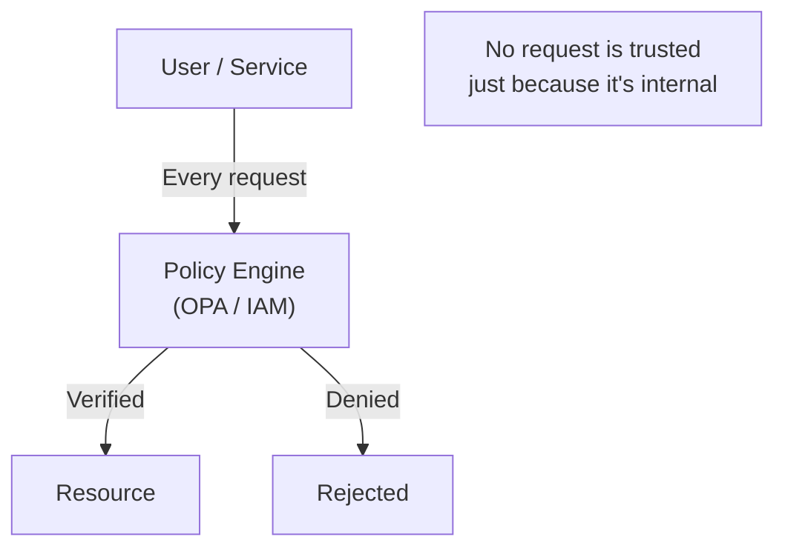
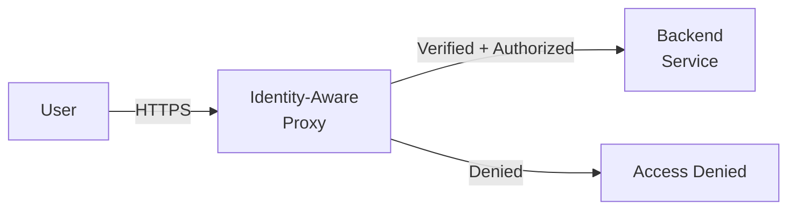
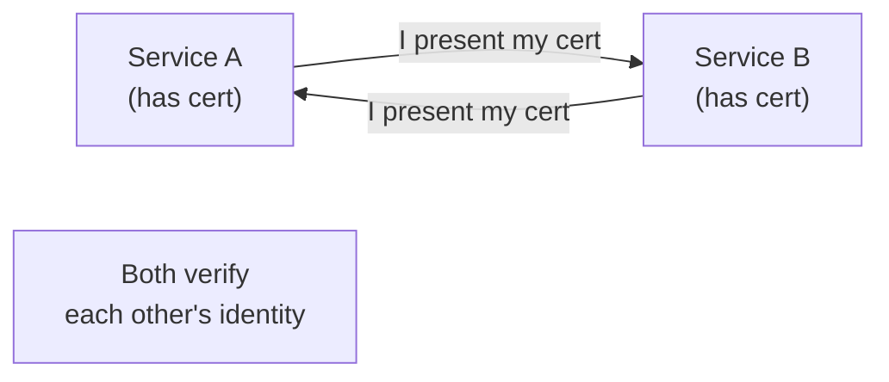

# Security Patterns

How to secure distributed systems in the cloud.

---

## Zero Trust Architecture

**Principle:** "Never trust, always verify." No implicit trust based on network location.

### Core Tenets

1. **Identity is the new perimeter** — not the network
2. **Least-privilege access** per request, not per network
3. **Continuous verification** — not one-time authentication
4. **Micro-segmentation** — isolate resources granularly
5. **Assume breach** — design as if attackers are already inside

### Implementation Layers

| Layer | Technology | What It Does |
|-------|-----------|-------------|
| Identity | OIDC/OAuth2, SAML | Authenticate users and services |
| Policy | OPA, AWS IAM, GCP IAM | Authorization decisions |
| Transport | mTLS, WireGuard | Encrypt all communication |
| Network | Security groups, network policies | Micro-segmentation |
| Data | Encryption at rest, field-level | Protect data directly |
| Monitoring | SIEM, Cloud Audit Logs | Detect and respond to threats |

### Zero Trust vs Traditional Security

| Aspect | Traditional (Castle & Moat) | Zero Trust |
|--------|---------------------------|------------|
| Perimeter | Network boundary | Identity boundary |
| Internal traffic | Trusted by default | Always verified |
| Access | Network-based | Request-based |
| Monitoring | Perimeter only | Every request |
| Breach impact | Full internal access | Limited by micro-segmentation |

### When to use

- Cloud-native applications (no clear network boundary)
- Remote workforce accessing internal services
- Multi-cloud or hybrid environments
- Compliance requirements (HIPAA, PCI-DSS, SOC 2)
- Any system where "internal" != "safe"

**Real-world:** Google BeyondCorp (pioneered Zero Trust), Cloudflare Access, AWS Verified Access

---

## Identity-Aware Proxy (IAP)

Intercepts requests and verifies user identity before forwarding to backend. Replaces VPN-based access control.

### How It Works

1. User sends request to IAP endpoint
2. IAP authenticates user via identity provider (Google, Okta, Azure AD)
3. IAP checks IAM permissions for the requested resource
4. If authorized → forwards to backend with verified identity headers
5. If denied → returns 403

### IAP vs VPN

| Aspect | VPN | IAP |
|--------|-----|-----|
| Access model | Network-level (connect to network → access all) | Request-level (each request verified) |
| Granularity | All-or-nothing per network | Per-service, per-user |
| Performance | Traffic routed through VPN concentrator | Direct connection to backend |
| Scalability | VPN concentrator is bottleneck | Distributed proxy |
| User experience | Must connect VPN first | Transparent (browser-based) |

### Cloud Provider Options

| Provider | Service | Key Feature |
|----------|---------|-------------|
| Google Cloud | IAP | Native GCP integration, BeyondCorp |
| AWS | Verified Access | Works with existing IAM policies |
| Azure | AD Application Proxy | Hybrid identity support |
| Cloudflare | Access | Zero Trust across any infrastructure |

### When to use

- Replacing VPN for internal tool access
- Developer access to staging/production environments
- Third-party contractor access with time-limited permissions
- Compliance requiring per-request audit logging

---

## mTLS (Mutual TLS)

Both client and server verify each other's identity via certificates.

**When to use:**
- Service-to-service communication in zero trust
- Service mesh (Istio, Linkerd provide mTLS automatically)
- API authentication between internal services

**Trade-offs:**
- ✅ Strong mutual authentication
- ✅ Encryption in transit
- ❌ Certificate management complexity
- ❌ Latency overhead for TLS handshake (mitigated by connection pooling)

---

## Security Design Principles

1. **Defense in depth** — Multiple layers, no single point of failure
2. **Least privilege** — Grant minimum necessary permissions
3. **Separation of duties** — No single person controls entire pipeline
4. **Security by default** — Secure configuration is the default
5. **Fail securely** — Deny by default when something goes wrong
6. **Don't security by obscurity** — Security shouldn't depend on secrecy

---

## Crosslinks

- [[Multi-Region Applications]] — Cross-region security and data sovereignty
- [[Multi-Region Kubernetes]] — Kubernetes network policies and service mesh security
- [[Deployment Patterns]] — Sidecar pattern for security sidecars
- [[Anti-Patterns]] — Security anti-patterns (hardcoded secrets, shared credentials)
