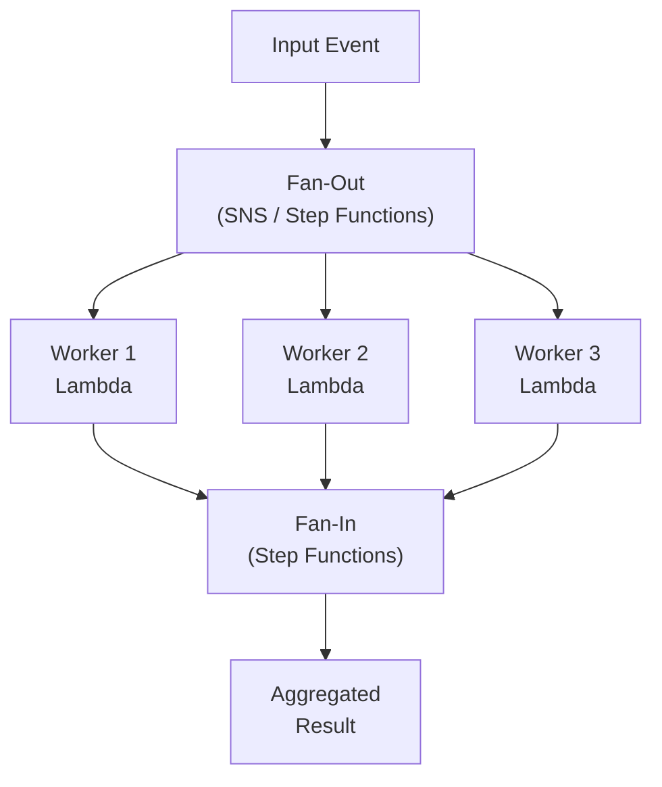
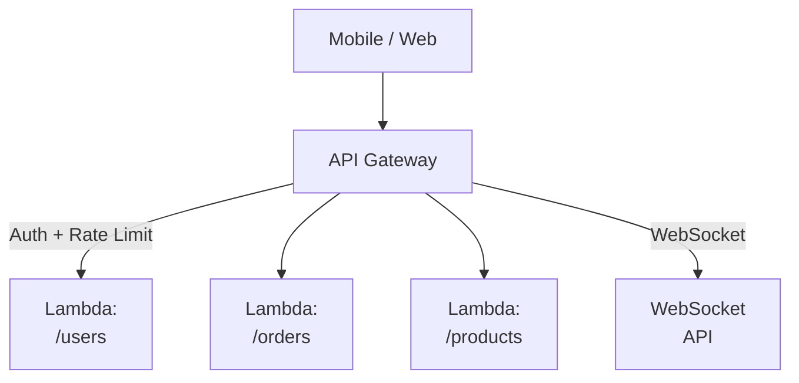
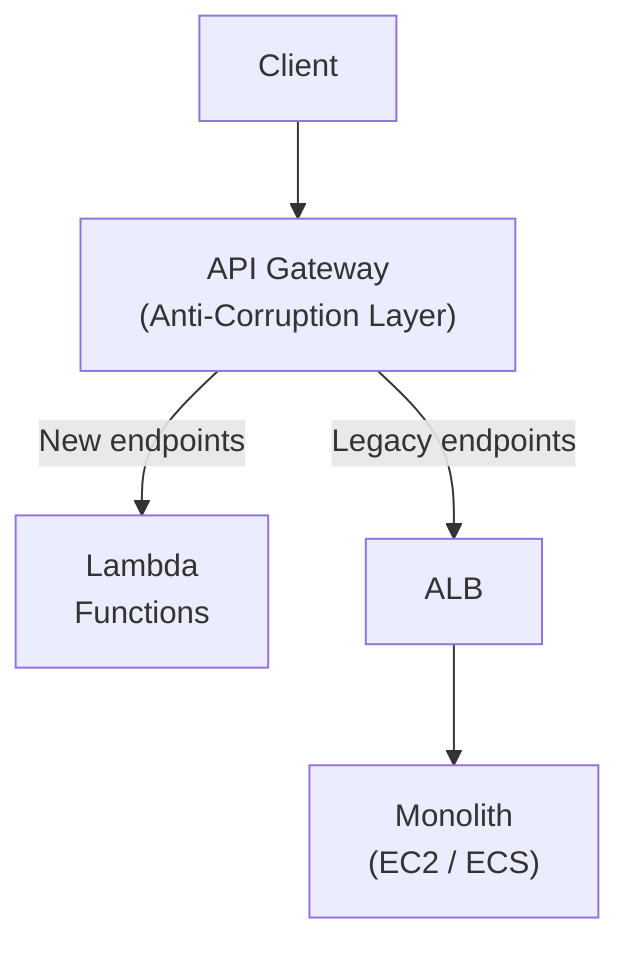

# Serverless Patterns

Patterns specific to Function-as-a-Service and serverless architectures.

---

## Fan-Out / Fan-In

A single event triggers parallel processing across multiple consumers, results are aggregated back.

**AWS Implementation:**
- **Fan-Out:** SNS topic broadcasts to multiple SQS queues
- **Workers:** Lambda functions consume from each queue
- **Fan-In:** Step Functions Map state or SQS + aggregator Lambda

**When to use:**
- Order processing (inventory, notifications, analytics simultaneously)
- Image/video transcoding to multiple formats
- Parallel data enrichment from multiple sources

**Trade-offs:**
- ✅ Massive parallelism with minimal infrastructure
- ✅ Each worker scales independently
- ❌ Aggregation logic can be complex
- ❌ Error handling across parallel workers needs careful design

---

## API Gateway Pattern

Single entry point for all client requests with authentication, throttling, caching, and routing.

**Key features:**
- Request/response transformation
- API key management and usage plans
- WAF integration for security
- Custom authorizers (Lambda-based auth)
- Canary deployments (traffic splitting)
- Protocol translation (REST ↔ WebSocket)

**When to use:**
- Any serverless application with multiple functions
- When you need centralized auth, throttling, and monitoring
- Mobile backends needing different APIs for different clients

**Trade-offs:**
- ✅ Single point for cross-cutting concerns
- ✅ No servers to manage
- ✅ Automatic scaling
- ❌ Additional latency (one extra hop)
- ❌ Vendor lock-in (API Gateway APIs differ per cloud)
- ❌ Cold starts for Lambda behind gateway

---

## Strangler Fig with Serverless

Incrementally migrate a monolith to serverless by routing through API Gateway.

**How it works:**
1. API Gateway sits in front of the monolith
2. Route new endpoints to Lambda/serverless backends
3. Route untouched endpoints to the monolith
4. Gradually extract capabilities until monolith is "strangled"

**Why serverless accelerates Strangler Fig:**
- No infrastructure to provision for new services
- Each extracted capability becomes a Lambda function
- API Gateway handles routing natively
- Pay-per-use during migration (no idle capacity)

---

## Serverless anti-patterns

**When NOT to use serverless:**

| Scenario | Why Serverless Fails |
|----------|---------------------|
| Long-running tasks (>15 min) | Lambda timeout limits |
| Consistent high throughput | Cold starts + cost higher than reserved compute |
| Tight latency requirements | Cold start latency (100ms-2s) |
| Large state | Lambda is stateless; need external state management |
| Complex dependencies | VPC configuration, container dependencies |

---

## Cost Model

| Component | Pricing |
|-----------|---------|
| API Gateway | $3.50 per million requests |
| Lambda | $0.20 per million requests + $0.0000166667 per GB-second |
| DynamoDB | Per request + storage |
| SQS | $0.40 per million requests |
| SNS | $0.50 per million requests |

**Break-even vs EC2:** Serverless is cheaper at low/variable traffic. EC2/ECS becomes cheaper at sustained high throughput.

---

## Crosslinks

- [[Decomposition Patterns]] — Strangler Fig pattern in detail
- [[Deployment Patterns]] — Feature flags for serverless gradual rollout
- [[Data Patterns]] — Event-driven patterns that power serverless
- [[Multi-Region Applications]] — Edge compute as serverless extension
