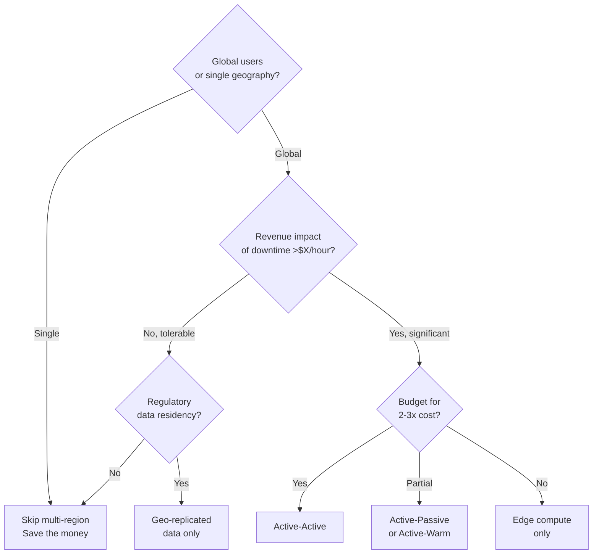

# Cost and Trade-offs

Multi-region isn't free. Understanding the real costs helps you decide when — and how — to do it.

---

## Cost Breakdown

### Compute

The biggest cost driver. You're running N copies of your infrastructure.

| Topology | Compute Cost vs Single Region |
|----------|-------------------------------|
| Single region | 1x (baseline) |
| Active-passive | 1.5–2x (standby runs at reduced capacity) |
| Active-warm | 1.5–2.5x (warm regions at partial capacity) |
| Active-active | 2–3x (all regions at full capacity) |

**Example:** If your single-region compute costs $5,000/month:
- Active-passive: $7,500–10,000/month
- Active-active: $10,000–15,000/month

### Data Transfer

Cross-region data transfer is charged per GB.

| Route | Typical Cost |
|-------|-------------|
| Same region (intra-zone) | Free or ~$0.01/GB |
| Cross-region (same continent) | $0.01–0.02/GB |
| Cross-continent | $0.05–0.09/GB |
| Egress to internet | $0.08–0.12/GB |

**Hidden costs:** Replication traffic, backup transfers, log shipping, cache synchronization.

**Example:** 1 TB of replication data per day across continents:
- 30 TB/month × $0.08/GB = **$2,400/month** just for replication bandwidth

### Managed Services

Cloud providers charge extra for multi-region features:

| Service | Single Region | Multi-Region |
|---------|--------------|--------------|
| Cloud SQL | $500/month | $800–1,200/month (cross-region replica) |
| DynamoDB | $1/GB | $2/GB (Global Tables) |
| Redis/Memorystore | $300/month | $600+/month (global replication) |
| Load Balancer | $20/month | $50–100/month (global LB) |

### Operations

Often underestimated:

- **Monitoring:** More regions = more dashboards, more alerts, more noise
- **On-call:** Engineers must understand multiple regions
- **Runbooks:** Failover procedures, region-specific quirks
- **Testing:** Chaos engineering, failover drills, data consistency checks
- **CI/CD:** Deploy to N regions, verify each, coordinate rollouts

**Rule of thumb:** Operations cost scales linearly with regions. Each new region adds ~30–50% more operational overhead.

---

## Total Cost Example

Small-to-medium application:

| Component | Single Region | Multi-Region (Active-Active, 2 regions) |
|-----------|--------------|------------------------------------------|
| Compute (VMs/containers) | $3,000 | $6,500 |
| Database (managed) | $800 | $1,800 |
| Load balancer | $50 | $120 |
| Data transfer | $200 | $800 |
| Monitoring | $100 | $250 |
| Operations overhead | $500 | $1,200 |
| **Total** | **$4,650** | **$10,670** |

That's **2.3x the cost** for multi-region. Worth it if you need the availability or latency benefits. Expensive if you don't.

---

## When Multi-Region Is NOT Worth It

Skip multi-region when:

- **Single-geography user base** — Users in one country don't benefit from distant regions
- **Startup/early stage** — Complexity kills velocity. Get product-market fit first.
- **Internal tools** — Intranet apps don't need global availability
- **Batch processing** — Offline jobs can tolerate single-region
- **Budget constraints** — The money is better spent on product development
- **Small team** — Multi-region requires operational maturity

**The 99.9% rule:** Single-region gives you ~99.9% availability (8.7 hours downtime/year). For most applications, that's enough. Multi-region pushes to 99.99%+ (52 minutes/year) — do you actually need that?

---

## When Multi-Region IS Worth It

Invest when:

- **Global user base** — Latency matters for user experience
- **Revenue per second is high** — Every minute of downtime = significant money lost (e.g., trading platforms, e-commerce during Black Friday)
- **Regulatory requirements** — Data must stay in certain jurisdictions (GDPR, data sovereignty)
- **Competitive requirement** — Competitors offer global availability
- **SLA commitments** — Contractual uptime requirements exceed single-region capabilities

**The revenue test:** If downtime costs you more than the multi-region premium, do it.

---

## Cost Optimization Strategies

### Tiered Replication

Not all data needs the same replication quality.

| Data Type | Replication | Cost |
|-----------|------------|------|
| User sessions | Sync (critical) | High |
| User-generated content | Async (important) | Medium |
| Analytics/events | Batch (nice-to-have) | Low |
| Static assets | CDN (global cache) | Very low |

### Right-Sizing Regions

Not every region needs the same capacity.

```
Region A (primary):    100% capacity  — full compute
Region B (secondary):   50% capacity  — handles failover
Region C (edge only):   10% capacity  — just CDN + edge compute
```

### Spot/Preemptible Instances for Warm Regions

Use cheap, interruptible instances for warm standby. They can be terminated at any time, but they're 60–80% cheaper. Accept the risk if your failover can handle it.

### Reserved Capacity for Primary

Lock in 1–3 year reserved instances for your primary region. 30–60% savings vs on-demand.

### Intelligent Tiering for Storage

Move cold data to cheaper storage classes automatically:
- Hot data: Standard ($0.02/GB)
- Warm data: Infrequent Access ($0.01/GB)
- Cold data: Archive ($0.004/GB)

---

## Decision Framework



---

## Cost Monitoring

Track these metrics to validate your multi-region investment:

| Metric | Why It Matters |
|--------|---------------|
| Cost per request by region | Are you getting ROI per region? |
| Cross-region transfer volume | Is replication traffic growing? |
| Failover frequency | How often do you actually failover? |
| Latency improvement | Did multi-region actually help users? |
| Uptime improvement | Did availability actually increase? |
| Revenue per region | Which regions generate value? |

**If you're paying 2x but latency only improved 5% and you've never failed over — reconsider the investment.**

---

## Crosslinks

- [[Deployment Topologies]] — Topology determines cost structure
- [[Failure Modes and Recovery]] — The failures that justify multi-region cost
- [[Designing Data-Intensive Applications]] — Part 06 (Partitioning) for data cost optimization
