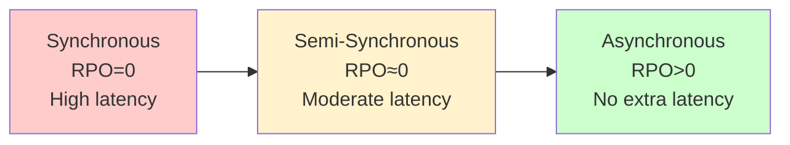
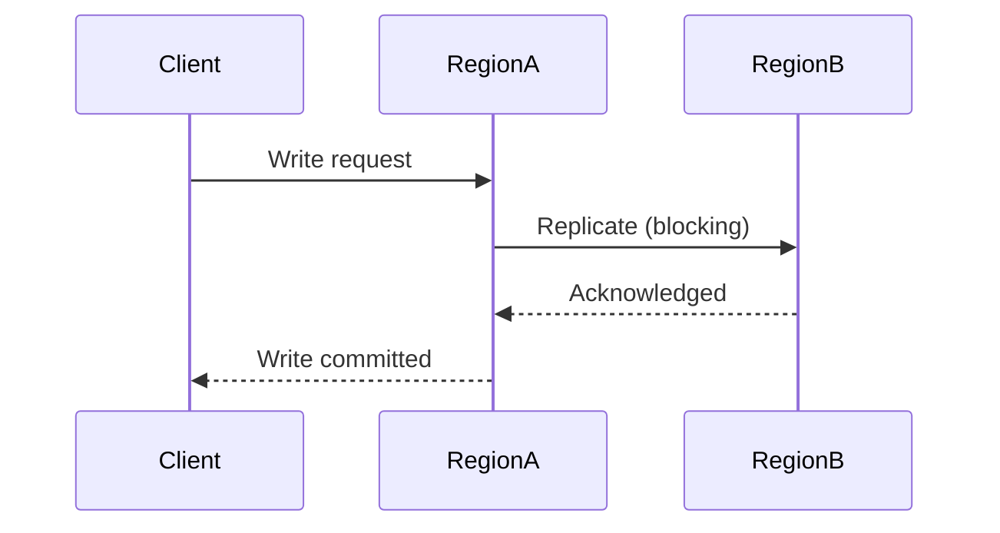
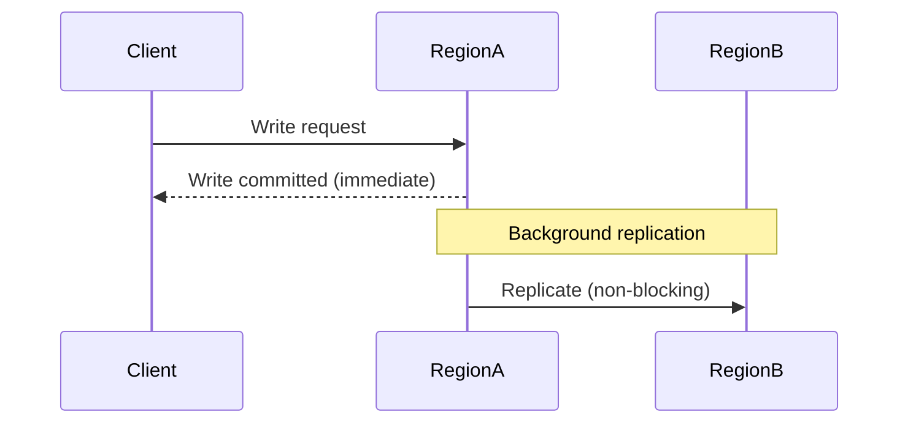
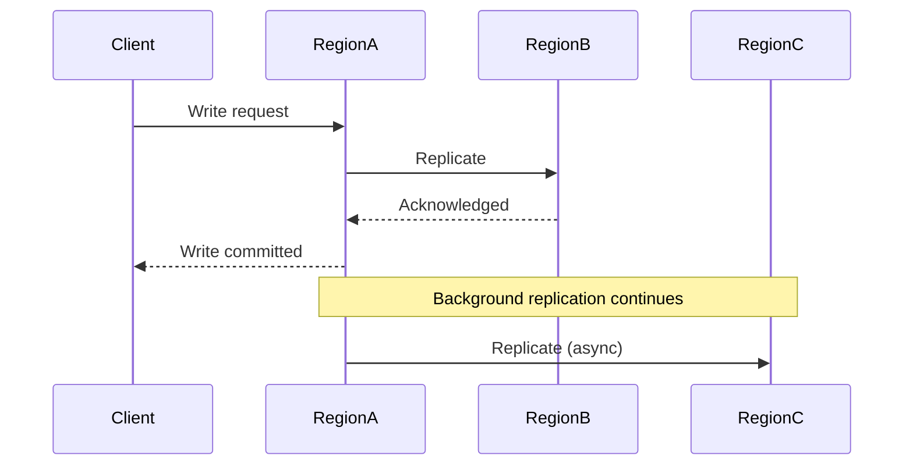

# Data Replication Strategies

The backbone of multi-region. Your replication choice determines consistency, latency, data loss risk, and conflict behavior.

---

## The Replication Spectrum



Each point trades data safety for performance.

---

## Synchronous Replication

A write is only acknowledged after it's committed in multiple regions.



**Properties:**
- **RPO:** Zero — no data loss possible
- **Write latency:** Round-trip to farthest replica region
- **Availability:** If replica region is down, ALL writes fail
- **Throughput:** Reduced by replication latency

**When to use:**
- Financial transactions (money transfers, payments)
- Inventory updates in manufacturing
- Any write where duplicate = bad

**When NOT to use:**
- Regions far apart (>50ms round-trip kills write performance)
- Write-heavy workloads (latency compounds)
- High availability is more important than zero data loss

**Real-world:** Google Spanner uses synchronous replication across zones with TrueTime (atomic clocks + GPS). This works at Google scale because their internal network is fast. Most companies can't replicate this.

---

## Asynchronous Replication

A write is committed locally and replicated in the background.



**Properties:**
- **RPO:** Greater than zero — depends on replication lag
- **Write latency:** Local only (fast)
- **Availability:** Writes succeed even if other regions are down
- **Throughput:** Not limited by replication

**Replication lag sources:**
- Network latency between regions
- Write volume (backlog in replication queue)
- Schema changes or large transactions
- Region recovery after outage (catch-up period)

**When to use:**
- Content delivery (blog posts, media)
- Social feeds (likes, comments, shares)
- Analytics and logging
- User preferences, settings

**When NOT to use:**
- Financial transactions where data loss = real money
- Regulatory requirements for zero data loss
- Systems where stale reads cause incorrect business decisions

---

## Semi-Synchronous Replication

A middle ground — write is committed locally + at least one other region acknowledges.



**Properties:**
- **RPO:** Near-zero (one replica always has the write)
- **Write latency:** Round-trip to nearest replica (not farthest)
- **Availability:** Needs at least one other region healthy
- **Throughput:** Moderate — limited by nearest replica speed

**When to use:**
- E-commerce orders (want durability but can't wait for global round-trip)
- Healthcare data (regulatory compliance with performance needs)
- Session state (must survive region loss, but millisecond lag is OK)

---

## Conflict Resolution

In active-active setups, the same data can be modified in two regions simultaneously. Conflicts are inevitable.

### Last-Writer-Wins (LWW)

Compare timestamps, latest write wins.

**How it works:** Each write gets a timestamp. On conflict, highest timestamp wins. Lower-timestamp write is silently discarded.

**Pros:** Simple, deterministic, no coordination needed.

**Cons:** Loses data. Clock skew can cause unpredictable results. If two writes happen within the same millisecond, behavior is implementation-dependent.

**Use when:** Conflicts are rare and losing a write is acceptable (user preferences, last-seen status).

---

### Application-Level Merge

Your code defines how to merge conflicting writes.

**Example — Shopping Cart Merge:**
```
Region A: {apple: 2, banana: 1}
Region B: {apple: 1, orange: 3}
Merged:   {apple: 3, banana: 1, orange: 3}  ← union with sum
```

**Pros:** Domain-aware. Can preserve user intent.

**Cons:** Must write merge logic for every data type. Testing is complex. Edge cases multiply.

**Use when:** Domain is well understood and merge rules are clear.

---

### CRDTs (Conflict-free Replicated Data Types)

Data structures that mathematically guarantee convergence without coordination.

**Common CRDT types:**

| Type | Operation | Use Case |
|------|-----------|----------|
| G-Counter | Increment only | Like counts, view counts |
| PN-Counter | Increment and decrement | Upvote/downvote |
| G-Set | Add only | Tags, labels |
| OR-Set | Add and remove | Shopping cart items |
| LWW-Register | Overwrite | Settings, preferences |
| RGA | Insert/delete in sequence | Collaborative text editing |

**Pros:** Provably correct. No merge logic needed — the data structure handles it.

**Cons:** Limited to specific operations. Complex types (nested objects, relations) are hard. Memory overhead for tombstones (tracking deletions).

**Use when:** Operations map cleanly to CRDT primitives (counters, sets, sequences).

**Real-world:** Redis CRDTs for Active-Active, Riak, Automerge, Yjs for collaborative editing.

---

### Partitioned Writes

Avoid conflicts by design — each region only writes to its own partition.

**How it works:**
- Data is partitioned by a key (user ID, geography, tenant)
- Each region "owns" certain partitions
- Writes always go to the owning region
- Reads can come from any region (with possible staleness)

**Pros:** No conflicts. Consistent writes. Scales horizontally.

**Cons:** Cross-partition operations are slow. Failover requires partition reassignment. Uneven load if partitions aren't balanced.

**Use when:** Data naturally partitions by geography or tenant.

**Real-world:** Cassandra (partition-aware routing), CockroachDB (range-based partitioning).

---

## Replication Topologies

### Star (Hub-and-Spoke)

One primary region, multiple secondaries replicate from it.

```
        Secondary B
           ↑
Secondary A → PRIMARY → Secondary C
```

**Pros:** Simple, single write source, easy to reason about.
**Cons:** Primary is a bottleneck. Primary failure requires re-electing.

### Ring

Regions replicate in a circular chain.

```
A → B → C → D → A
```

**Pros:** No single point of failure for replication.
**Cons:** Slow propagation (D must wait for C → B → A chain). One broken link breaks the ring.

### Mesh (All-to-All)

Every region replicates to every other region.

```
A ←→ B
↕     ↕
C ←→ D
```

**Pros:** Fastest propagation. No single point of failure.
**Cons:** N×(N-1)/2 replication links. Conflict resolution required. Network overhead scales quadratically.

---

## Crosslinks

- [[Deployment Topologies]] — How regions are arranged
- [[Failure Modes and Recovery]] — What happens when replication breaks
- [[Designing Data-Intensive Applications]] — Part 05 (Replication) covers this in depth
