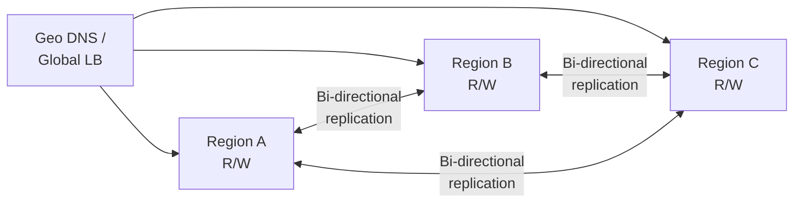
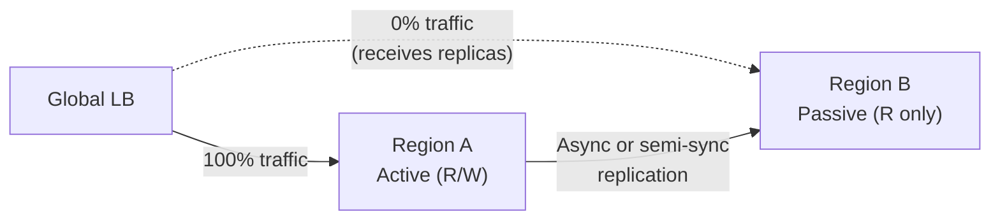
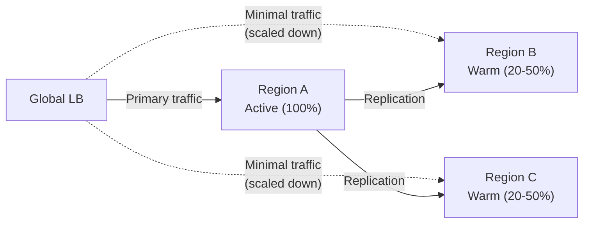

# Deployment Topologies

How you arrange your regions determines availability, cost, and complexity.

---

## Active-Active

All regions serve traffic simultaneously. No primary — every region is a peer.

**How it works:**
- Users routed to nearest region
- Each region accepts reads AND writes
- Data replicated bi-directionally across all regions
- If one region dies, others absorb the traffic

**Trade-offs:**
| Aspect | Impact |
|--------|--------|
| Availability | Highest — survives full region loss |
| Latency | Lowest for users near any region |
| Cost | Highest — all regions at full capacity |
| Complexity | Highest — conflict resolution required |
| Consistency | Eventual (or requires coordination) |

**Conflict resolution approaches:**
- CRDTs for counters, sets, registers
- Application-level merge logic for domain data
- Last-writer-wins for low-stakes data (preferences, settings)
- Partitioned writes — each region "owns" certain data keys

**Best for:** Global consumer apps, CDNs, collaborative tools, social platforms.

**Real-world examples:** Cloudflare (every edge is active), CockroachDB multi-region, Cassandra multi-DC.

---

## Active-Passive (Hot Standby)

One region serves all traffic. The other receives replicated data but doesn't serve users — until failover.

**How it works:**
- Primary region handles all reads and writes
- Standby region continuously receives data copies
- On failure, DNS/LB switches traffic to standby
- Standby becomes the new primary

**Failover process:**
1. Health checks detect primary region failure (30s–2min)
2. Load balancer stops routing to primary
3. Standby promoted to primary (may require read-only → read-write transition)
4. DNS updated to point to new primary
5. Old primary recovered → becomes new standby (after catching up)

**Trade-offs:**
| Aspect | Impact |
|--------|--------|
| Availability | Good — survives region loss with brief interruption |
| Latency | Optimal for primary region users, worse for far users |
| Cost | Moderate — standby idles but still costs money |
| Complexity | Moderate — no conflict resolution needed |
| Consistency | Stronger — single write source |

**Data loss window:** Depends on replication mode.
- Async: seconds to minutes of writes may be lost
- Semi-sync: near-zero data loss
- Sync: zero data loss but higher latency

**Best for:** Transactional systems, databases, financial applications, traditional enterprise.

**Real-world examples:** AWS RDS Multi-AZ, Google Cloud SQL cross-region replicas, PostgreSQL streaming replication.

---

## Active-Warm

Like active-passive, but the standby regions run at reduced capacity — ready to scale up but not idle.

**How it works:**
- Primary region at full capacity
- Warm regions run a subset of services or scaled-down instances
- On failover, warm regions scale up (auto-scaling policies)
- Cost savings vs active-active since warm regions use less compute

**Scaling challenge:** If warm regions run at 20% capacity and must absorb 100% of primary traffic, they need to scale 5x rapidly. Auto-scaling speed becomes critical.

**Trade-offs:**
| Aspect | Impact |
|--------|--------|
| Availability | Good — faster than cold start, slower than hot standby |
| Latency | Good for nearby users, variable during scale-up |
| Cost | Lower than active-active, higher than active-passive |
| Complexity | High — must test scale-up regularly |
| Consistency | Strong (single primary writes) |

**Best for:** Cost-conscious multi-region where you want some readiness without full active-active cost.

---

## Comparison Matrix

| Criterion | Active-Active | Active-Passive | Active-Warm |
|-----------|--------------|----------------|-------------|
| Availability | 99.99%+ | 99.9–99.99% | 99.9–99.99% |
| Data loss (RPO) | Varies by replication | Zero to minutes | Zero to minutes |
| Recovery time (RTO) | Near-zero | Minutes | Seconds to minutes |
| Cost (vs single region) | 2–3x | 1.5–2x | 1.5–2.5x |
| Conflict resolution | Required | Not needed | Not needed |
| Operational complexity | High | Medium | High |
| Write latency | Local (fast) | Depends on replication mode | Local (fast) |

---

## Hybrid Approaches

Most real systems don't use a pure topology. Common hybrids:

**Regional pairs:** Two active-active regions per geography, active-passive between geographies. Balances latency within a continent with cost across continents.

**Tiered replication:** Critical data syncs synchronously, non-critical data replicates asynchronously. Different consistency levels for different data types.

**Read replicas + single primary:** Reads from any region (low latency), writes go to primary only (consistency). Common pattern for databases (PostgreSQL, MySQL).

---

## Crosslinks

- [[Data Replication Strategies]] — How data flows between regions
- [[Traffic Routing and Latency]] — How users reach the right region
- [[Designing Data-Intensive Applications]] — Part 05 (Replication), Part 06 (Partitioning)

---

## Glossary

| Term | Definition |
|------|------------|
| **Active-Active** | All regions serve full traffic simultaneously. No primary — every region is a peer. |
| **Active-Passive** | One region serves traffic, the other receives replicated data but stays idle until failover. |
| **Active-Warm** | Primary at full capacity, secondaries at reduced capacity — ready to scale up on failover. |
| **Failover** | Switching traffic from a failed region to a healthy one. |
| **Hot Standby** | A passive region that receives continuous data replication and can take over quickly. |
| **Hybrid Topology** | Combining active-active within a geography with active-passive across geographies. |
