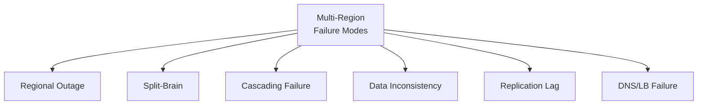
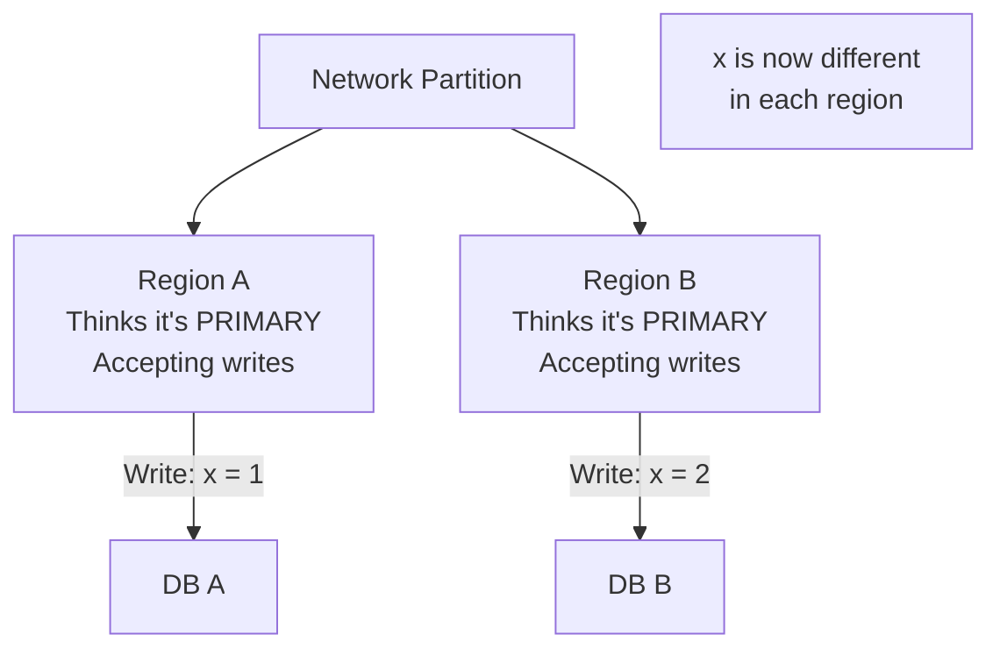
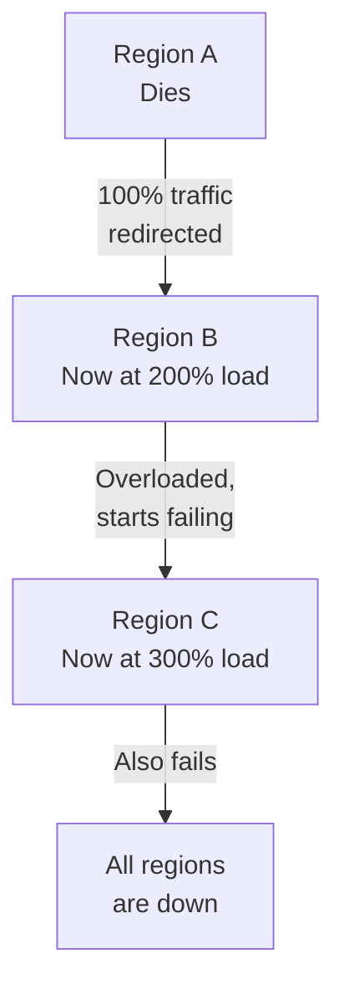

# Failure Modes and Recovery

Multi-region adds redundancy, but it also adds new ways things can break.

---

## Failure Taxonomy



---

## 1. Regional Outage

One region becomes completely unreachable.

**Real-world examples:**
- AWS US-East-1 outage (2021): Took down major services for hours
- Google Cloud us-central1 outage (2023): Affected YouTube, Gmail
- Azure South Central US (2018): Cooling system failure

**Impact cascade:**
1. Primary region goes down
2. Health checks detect failure (30s–2min delay)
3. Traffic rerouted to surviving regions
4. Surviving regions must absorb full load
5. If surviving regions are at capacity → cascading failure

**Recovery steps:**
1. **Detect:** Health checks, monitoring alerts, user reports
2. **Contain:** Stop sending traffic to failed region
3. **Absorb:** Surviving regions scale up (pre-provisioned capacity or auto-scaling)
4. **Communicate:** Status page, user notifications
5. **Recover:** Restore failed region, verify data consistency
6. **Learn:** Post-incident review, update runbooks

**Key metric — Time to Detect (TTD):** How long before you know a region is down?
- Health checks: 30s–2min (if configured well)
- User reports: 5–30 minutes
- Monitoring: Depends on alerting configuration

---

## 2. Split-Brain

Two regions both think they're the primary. Both accept writes. Data diverges.



**How it happens:**
1. Network partition isolates regions
2. Each region independently decides it should be primary
3. Both accept writes
4. Partition heals — now you have conflicting data

**Prevention strategies:**

**Fencing tokens:** Include a monotonically increasing token with every write. If a stale leader sends a write with an old token, the receiver rejects it.

**Majority quorum:** Only allow writes when a majority of regions are reachable. 3 regions → need 2 to agree. 5 regions → need 3.

**Leader election via consensus:** Use Raft or Paxos to elect a single leader. Losers become read-only followers.

**Split-brain detection:** If you can't reach other regions, assume YOU might be the problem (not them). Fail safely rather than risk split-brain.

---

## 3. Cascading Failure

One region's failure overloads another, which then fails too.



**Why it happens:**
- Surviving regions weren't sized for full traffic
- Auto-scaling is too slow
- Retry storms amplify load
- Dependent services (databases, caches) get overwhelmed

**Prevention:**

**Capacity planning:** Each region must handle 100% of traffic independently. If you can't, accept reduced capacity during failover.

**Rate limiting:** Limit per-region and per-service request rates. Drop excess requests with 429 (Too Many Requests) instead of crashing.

**Circuit breakers:** If a service is failing, stop sending requests. Let it recover. Don't pile on.

**Load shedding:** Prioritize critical traffic. During overload, serve read-only users but reject non-critical writes.

**Bulkheads:** Isolate services so one failure doesn't take down everything. Database, cache, API — separate failure domains.

---

## 4. Data Inconsistency After Failover

Users see different data depending on which region they hit.

**Scenarios:**
- User writes to Region A, immediately reads from Region B (stale data)
- User's session cookie points to Region A, but A is down → redirected to B
- After failover, old region comes back with stale data and starts serving

**Mitigation:**

**Strong consistency for critical reads:** Read from primary for operations where staleness = incorrect (account balance, inventory count).

**Version vectors:** Include version numbers with data. If a read returns a lower version than the client has seen, reject or retry.

**Graceful degradation messages:** Show "data is being updated" instead of incorrect data.

**Session draining:** After failover, wait for existing sessions to expire before serving from new region. Prevents mid-session region switches.

---

## 5. Replication Lag

Data in the secondary region is behind the primary.

**When lag matters:**
- User creates account in Region A, tries to log in via Region B (not replicated yet)
- User places order, refreshes page in different region (order not visible)
- Failover happens during high replication lag → data loss window is large

**Monitoring lag:**
```sql
-- PostgreSQL example
SELECT now() - pg_last_xact_replay_timestamp() AS replication_lag;

-- MySQL example
SHOW SLAVE STATUS\G  -- Seconds_Behind_Master
```

**Alert thresholds:**
- Warning: lag > 1 second
- Critical: lag > 10 seconds
- Emergency: lag > 60 seconds

**Reducing lag:**
- Optimize replication (parallel replication, batch commits)
- Reduce write volume to large objects (images, blobs → store in object storage, replicate separately)
- Use semi-synchronous for critical data

---

## 6. DNS/LB Failure

The routing layer itself fails. Users can't reach ANY region.

**This is the "irony of multi-region"** — you've distributed everything except the single point of failure in your routing.

**Mitigation:**
- Use multiple DNS providers (primary + secondary)
- Health checks at multiple levels (TCP, HTTP, application)
- Cache DNS responses locally in application (fallback IPs)
- DNS TTL should be low enough for failover, high enough for stability
- Have a manual failover process documented for when automation fails

---

## Chaos Engineering for Multi-Region

Test your resilience before production failures test it.

**Exercises:**
1. **Region kill:** Shut down an entire region. Measure time to recovery.
2. **Network partition:** Block traffic between regions. Verify split-brain prevention works.
3. **Replication lag injection:** Artificially slow replication. Verify application handles stale data.
4. **Failback test:** After failover, bring the old region back. Verify data consistency.
5. **Capacity test:** Send 2x normal traffic to one region. Verify it handles the load.

**Tools:** Chaos Monkey (Netflix), Litmus (Kubernetes), Toxiproxy (network fault injection).

**Key principle:** If you haven't tested it, it doesn't work.

---

## Incident Response Checklist

For multi-region outages:

1. [ ] Confirm which regions are affected
2. [ ] Verify health checks are detecting the issue
3. [ ] Confirm traffic is being rerouted
4. [ ] Check surviving region capacity — are they at risk of overload?
5. [ ] Monitor replication lag — how much data is at risk?
6. [ ] Communicate to users (status page, notifications)
7. [ ] Monitor for cascading failures
8. [ ] Document timeline in real-time
9. [ ] After recovery: verify data consistency across regions
10. [ ] Post-incident: update runbooks, add tests for what failed

---

## Crosslinks

- [[Data Replication Strategies]] — How replication works and fails
- [[Traffic Routing and Latency]] — How routing recovers from failure
- [[Deployment Topologies]] — Topology determines failure blast radius
- [[Designing Data-Intensive Applications]] — Part 08 (The Trouble with Distributed Systems), Part 09 (Consistency and Consensus)
