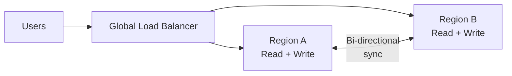
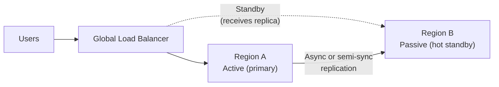
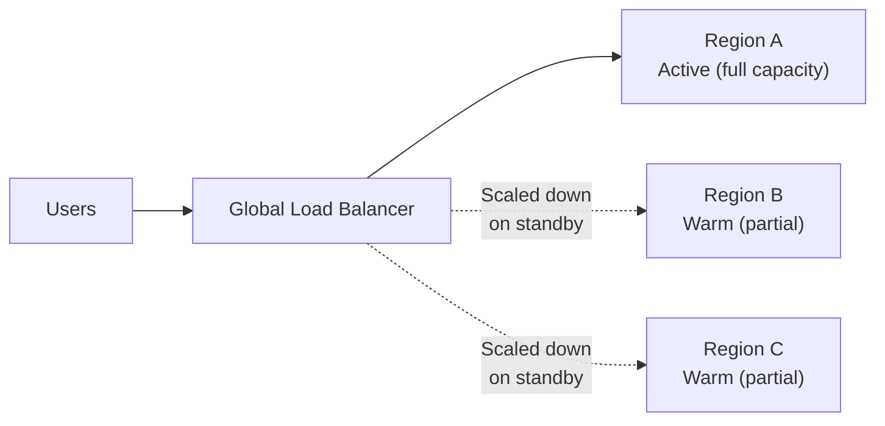
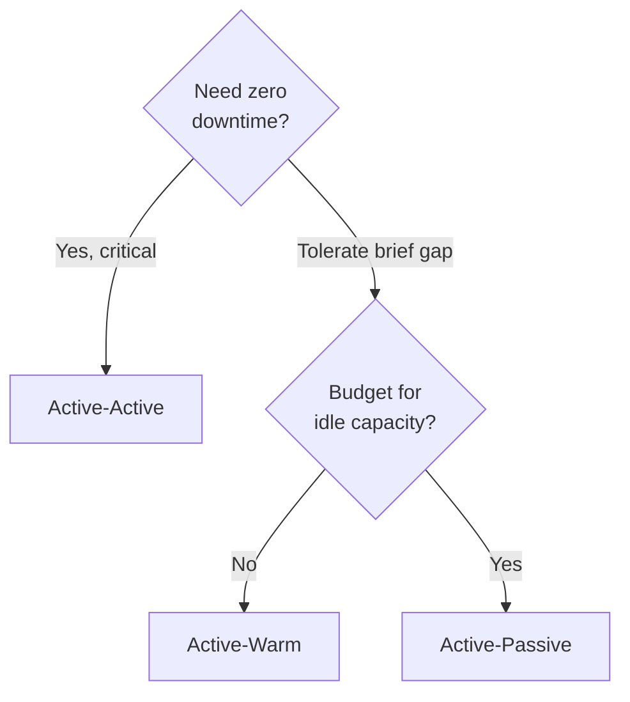

# Multi-Region Applications

**What it is:** Designing and operating applications that run across two or more geographic regions — serving users from the nearest location and surviving regional failures.

**Why it matters:** Latency drops, availability increases, and data sovereignty requirements get met. But complexity multiplies.

**When to do it:** When a single region's latency, availability ceiling, or regulatory constraints aren't enough. Not every app needs it — start with one region.

---

## When Multi-Region Makes Sense

| Signal | Single Region OK | Multi-Region Needed |
|--------|-------------------|---------------------|
| Users in one geography | ✓ | |
| Users across continents | | ✓ |
| < 99.9% uptime acceptable | ✓ | |
| 99.99%+ uptime required | | ✓ |
| No data residency laws | ✓ | |
| GDPR, data sovereignty rules | | ✓ |
| RPO = minutes acceptable | ✓ | |
| RPO = seconds or zero | | ✓ |

**Key insight:** Most applications start single-region. Multi-region is an evolution, not a starting point.

---

## Deployment Topologies

Three main patterns, each with different trade-offs:

### Active-Active

Every region serves full traffic. No "primary" — all regions are peers.

**Pros:** Maximum availability, lowest latency for users near each region, no failover delay.

**Cons:** Conflict resolution is hard. Every write can happen anywhere. Data must converge.

**Best for:** Read-heavy apps with eventual consistency tolerance (social media, content delivery).

### Active-Passive (Hot Standby)

One region serves all traffic. The other is pre-warmed but idle.

**Pros:** No conflict resolution needed. Simple data model. Fast failover.

**Cons:** Wasted capacity in passive region. Failover still takes seconds to minutes.

**Best for:** Traditional databases, transactional systems, when consistency > availability.

### Active-Warm

One region is primary. Others run at partial capacity — scaled down but ready to scale up.

**Pros:** Better cost than active-active. Faster recovery than active-passive.

**Cons:** Cold start for traffic ramp-up. Partial capacity may not handle full load immediately.

**Best for:** Cost-sensitive multi-region where you want some availability benefit without full active-active cost.

---

## Choosing a Topology

---

## Data Replication

The hardest part of multi-region. Your choice here determines everything else.

### Synchronous Replication

Write is committed in all regions before acknowledging to the client.

- **RPO:** 0 (zero data loss)
- **RTO:** Near-zero (all regions have the same data)
- **Latency cost:** Every write pays the round-trip to the farthest region
- **Availability cost:** If any region is unreachable, writes fail everywhere

**Use when:** Financial transactions, inventory updates, any write that MUST NOT be lost or duplicated.

### Asynchronous Replication

Write is committed locally and replicated in the background.

- **RPO:** Depends on replication lag (seconds to minutes)
- **RTO:** Fast — just redirect traffic
- **Latency cost:** None — local writes only
- **Availability cost:** Writes succeed even if other regions are down

**Use when:** Social feeds, analytics, content publishing — where slight lag is acceptable.

### Semi-Synchronous Replication

Write committed locally + at least one other region acknowledges before confirming.

- **RPO:** Very small (one region might lag by milliseconds)
- **RTO:** Fast
- **Latency cost:** Moderate — depends on closest replica region
- **Availability cost:** Moderate — needs at least one other region healthy

**Use when:** You want better guarantees than async but can't pay the full sync cost.

---

## Conflict Resolution

When two regions accept the same write simultaneously, conflicts arise.

### Last-Writer-Wins (LWW)

Timestamp-based. Latest write wins. Simple but loses data.

- **Use when:** Conflicts are rare and data loss is acceptable (e.g., user preferences)
- **Don't use when:** Two users editing the same document

### Application-Level Resolution

Your code decides how to merge conflicting writes.

- **Use when:** You understand the domain and can define merge rules (e.g., merge shopping carts by unioning items)
- **Don't use when:** Domain is too complex or conflicts are unpredictable

### CRDTs (Conflict-free Replicated Data Types)

Data structures that mathematically guarantee convergence without coordination.

- **Use when:** Counter operations, sets, registers, sequences — well-defined data types
- **Don't use when:** You need complex relational integrity

---

## Traffic Routing

How users reach the right region.

### GeoDNS / Geo-based Load Balancing

DNS resolves to the nearest region based on client IP.

- **Pros:** Simple, transparent to users
- **Cons:** DNS caching means failover is slow (TTL-dependent). No health checking.
- **Providers:** AWS Route 53, Cloudflare, Google Cloud DNS

### Anycast

Multiple regions announce the same IP. BGP routes to the nearest.

- **Pros:** Automatic failover (BGP converges), lowest latency
- **Cons:** Requires your own IP space or provider support. Limited to TCP/UDP.
- **Used by:** Cloudflare, Google, major CDNs

### Global Load Balancer (L7)

HTTP-level routing with health checks and session affinity.

- **Pros:** Health-aware, can route by header/path/cookie, fast failover
- **Cons:** Adds a hop. Provider lock-in.
- **Providers:** Google Cloud Global Load Balancer, AWS ALB + Route 53, Cloudflare Load Balancer

### Edge Compute / CDN Workers

Run logic at 300+ edge locations. Data stays in origin regions, logic is everywhere.

- **Pros:** Lowest latency for compute. No region management for simple logic.
- **Cons:** Limited runtime (Cloudflare Workers, Vercel Edge Functions). State must go to origin.
- **Use when:** Auth, personalization, A/B testing, API gateway logic

---

## Failure Modes

### Regional Outage

The most common multi-region failure. One region becomes unreachable.

**Recovery steps:**
1. Health checks detect failure (30s–2min)
2. Traffic rerouted to healthy regions
3. Remaining regions absorb full load (must have capacity)
4. Failed region recovered — rejoin and catch up on replication

### Split-Brain

Both regions think they're primary. Both accept writes. Data diverges.

**Prevention:**
- Use consensus (Raft/Paxos) for leader election
- Fence tokens to prevent stale leaders from writing
- Design for partition tolerance (CAP theorem)

### Cascading Failure

One region's failure overloads another region, which then fails too.

**Prevention:**
- Rate limiting per region
- Circuit breakers between services
- Capacity planning: each region must handle 100% of traffic

### Data Inconsistency After Failover

Users see different data depending on which region they hit.

**Mitigation:**
- Strong consistency for critical reads (read from primary)
- Version vectors to detect stale reads
- User-facing "data is being synchronized" messages

---

## Cost Considerations

Multi-region isn't free. Key cost drivers:

| Cost Factor | Impact |
|-------------|--------|
| Compute duplication | 2–3x your single-region cost |
| Cross-region data transfer | $0.01–0.09/GB depending on provider |
| Replication infrastructure | Managed services (Cloud SQL, DynamoDB Global Tables) charge for replication |
| Load balancing | Global LB costs per million requests |
| Operational complexity | More monitoring, more runbooks, more on-call surface |
| Storage duplication | Full data copy in each region |

**Rule of thumb:** Multi-region costs 2–4x a single region, depending on topology and data volume.

---

## Decision Framework

1. **Start single-region.** Get the app working and stable.
2. **Measure latency.** If users in other geographies complain (>200ms), consider multi-region.
3. **Check requirements.** Regulatory (data residency), uptime (99.99%+), or RPO (near-zero) may force it.
4. **Pick topology.** Active-passive for simplicity, active-active for maximum availability.
5. **Solve data first.** Your replication strategy determines everything else.
6. **Build for failure.** Test region failover regularly. If you can't test it, it won't work when you need it.

---

## Deep Dives

- [[Deployment Topologies]] — Active-active, active-passive, active-warm patterns
- [[Data Replication Strategies]] — Sync, async, semi-sync, CRDTs, conflict resolution
- [[Traffic Routing and Latency]] — GeoDNS, anycast, global LB, edge compute
- [[Multi-Region Databases]] — CockroachDB, Spanner, YugabyteDB, DynamoDB Global Tables
- [[Multi-Region Kubernetes]] — Federation, Istio service mesh, GitOps, blue-green deployments
- [[Failure Modes and Recovery]] — Regional outages, split-brain, cascading failures
- [[Testing, Chaos Engineering and Observability]] — Failover testing, LitmusChaos, distributed tracing, SLOs
- [[Real-World Case Studies]] — Netflix, Uber, Stripe, Shopify, Discord, Cloudflare, Spanner
- [[Cost and Trade-offs]] — When multi-region is worth it, cost optimization

---

## Related Topics

- [[Designing Data-Intensive Applications]] — Parts 05 (Replication), 06 (Partitioning), 08 (Distributed Troubles), 09 (Consistency and Consensus)
- [[A Philosophy of Software Design]] — Complexity management applies to multi-region systems

---

## References

- Kleppmann, M. (2017). *Designing Data-Intensive Applications*. O'Reilly. Chapters 5, 6, 8, 9.
- Burns, B. (2018). *Designing Distributed Systems*. O'Reilly.
- Netflix TechBlog: Active-Active Multi-Region (2016)
- Uber Engineering: Tiered Failover Architecture (2020, 2026)
- Stripe Engineering: Multi-Region Payments Architecture
- YugabyteDB Case Study: Shopify Migration
- Google Spanner Paper (2012)
- Cloudflare: Architecting on the Edge
- AWS Multi-Region Architecture Whitepapers
- CNCF: LitmusChaos Documentation
