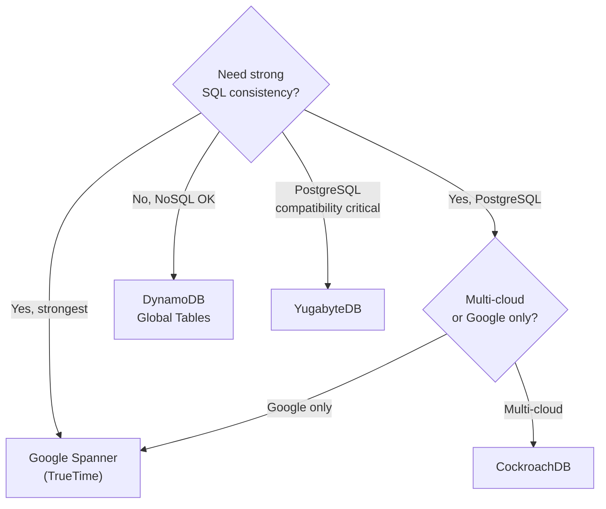

# Multi-Region Databases

The database choice often dictates the entire multi-region architecture. Each database brings different trade-offs for consistency, latency, and operational complexity.

---

## Comparison Matrix

| Feature | CockroachDB | Google Spanner | YugabyteDB | DynamoDB Global Tables |
|---------|------------|----------------|------------|----------------------|
| Model | Distributed SQL | Relational + TrueTime | Distributed SQL (PG compat) | Managed NoSQL |
| Consensus | Raft | Paxos | Raft | Paxos-like |
| Write latency (cross-region) | 50–100ms | 10–50ms (TrueTime) | 50–100ms | 50–200ms |
| Read latency (local) | <20ms | <10ms | <20ms | <10ms |
| Availability | 99.99% | 99.999% | 99.99% | 99.99% |
| SQL compatibility | PostgreSQL | Google SQL (proprietary) | PostgreSQL | No (NoSQL) |
| Geo-partitioning | Row-level | Database-level | Row-level | Table-level |
| Conflict resolution | Consensus (no conflicts) | TrueTime (no conflicts) | Consensus or xCluster | LWW |
| Best for | Multi-cloud, flexibility | Google ecosystem, strongest consistency | PostgreSQL migration, multi-cloud | Serverless, high-throughput |

---

## CockroachDB

### Architecture
- Distributed SQL using Raft consensus
- Nodes start with `--locality=region=us-west-1,zone=usw1-az1` for intelligent replica placement

### Key Concepts

**Cluster Region:** Geographic region specified at node startup.

**Database Region:** Region assigned to a database:
```sql
ALTER DATABASE mydb PRIMARY REGION us-east-1;
ALTER DATABASE mydb ADD REGION eu-west-1;
```

**Survival Goals:** Zone-level or region-level failure tolerance.

**Table Locality — Three Modes:**

| Mode | Replicas | Write Latency | Read Latency | Use Case |
|------|----------|---------------|-------------|----------|
| `GLOBAL` | Everywhere | Higher (quorum) | Lowest (local read) | Reference data, config |
| `REGIONAL BY TABLE` | One region | Lowest (local write) | Lowest (local read) | Region-specific data |
| `REGIONAL BY ROW` | Per-row | Lowest | Lowest | User data partitioned by region |

### Data Domiciling (Super Regions)
Super Regions enforce that regional table replicas exist *only* within member regions. Critical for compliance:
```sql
ALTER DATABASE mydb ADD SUPER REGION "europe"
  VALUES (eu-west-1, eu-central-1);
```

### Performance
- Optimized clusters: <20ms reads, <50ms writes
- Geo-partitioning reduces latency by 50%
- Follower reads serve from nearest replica

---

## Google Spanner

### Architecture
- Data split into **tablets** (key-value pairs with timestamps)
- Tablets stored on **Colossus** (fault-tolerant distributed file system)
- **TrueTime API:** Atomic clocks + GPS clocks for globally consistent timeline

### Instance Types

| Type | Replicas | Regions | Availability | Write Quorum |
|------|----------|---------|-------------|-------------|
| Regional | 3 (across 3 zones) | 1 | 99.99% | 2/3 |
| Multi-region | 5+ (across 3+ regions) | 2+ | 99.999% | Cross-region |
| Dual-region | 2 read-write + 1 witness per region | 2 | High | Cross-region |

### Witness Replicas
Don't store full data; participate in voting to form majority quorum. Reduce cost while maintaining availability.

### Read Patterns
- **Strong reads:** Always return latest committed data via leader verification
- **Stale reads:** Up to 10 seconds old for lower latency (recommended staleness: 15 seconds)
- **Leaderless reads:** Can read from any replica for lowest latency

### TrueTime Mechanics
- Servers sync with time masters **~every 30 seconds**
- Uncertainty typically **under 10 milliseconds**
- `Commit Wait` ensures transactions are serialized in global order
- Enables External Consistency (linearizability across all regions)

---

## YugabyteDB

### Architecture
- PostgreSQL-compatible distributed SQL
- Four multi-region deployment modes:

| Mode | Replication | Write Latency | Read Latency | RPO |
|------|------------|---------------|-------------|-----|
| Default Synchronous | Sync across regions | High | High | None |
| Geo-partitioning | Sync in-region | Low | Low (nearby) | None |
| xCluster | Async bidirectional | Low | Low | Some loss |
| Read Replicas | Async unidirectional | N/A (primary only) | Low | None |

### Row-Level Geo-Partitioning
Per-row control over data placement using partition tables with tablespace groups mapped to regions:
```sql
CREATE TABLESPACE eu_tablespace WITH (replica_placement='{"num_replicas":3}');
ALTER TABLE users PARTITION BY LIST (region);
CREATE TABLE users_us PARTITION OF users FOR VALUES IN ('us')
  TABLESPACE us_tablespace;
CREATE TABLE users_eu PARTITION OF users FOR VALUES IN ('eu')
  TABLESPACE eu_tablespace;
```

### xCluster Replication
Transactional asynchronous replication for DR scenarios. Supports bidirectional (active-active) with conflict resolution.

---

## DynamoDB Global Tables

### Architecture
- Fully managed multi-active, multi-region replication
- Any replica serves reads/writes

### Consistency Modes

| Mode | Consistency | Latency | Use Case |
|------|------------|---------|----------|
| **MREC** (Multi-Region Eventual) | Eventual | Lower | Default, most workloads |
| **MRSC** (Multi-Region Strong) | Strong | Higher | Critical reads requiring freshness |

**Constraint:** Consistency mode cannot be changed after creation.

### Account Models
- **Same-Account:** All replicas in one AWS account. Single IAM/KMS boundary.
- **Multi-Account:** Replicas across accounts. Distinct IAM, KMS, billing. Ideal for federated teams.

### Conflict Resolution
Last-writer-wins across all replicas. No built-in CRDT or merge — application-level design required for conflicting writes.

### Best Practices
- Use **global tables with DAX** for caching across regions
- **Auto-scaling** per region (not global)
- **Point-in-time recovery** per region
- Monitor **replication lag** via CloudWatch metrics

---

## Decision Guide



---

## Crosslinks

- [[Data Replication Strategies]] — How replication works under the hood
- [[Real-World Case Studies]] — Shopify's YugabyteDB migration, Google Spanner in practice
- [[Deployment Topologies]] — How databases fit into regional architectures
- [[Designing Data-Intensive Applications]] — Part 05 (Replication), Part 06 (Partitioning)
