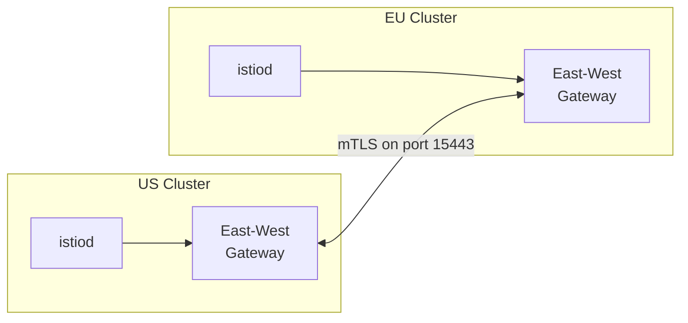

# Multi-Region Kubernetes & Service Mesh

Kubernetes is not region-aware by default. Multi-region K8s requires federation, cross-cluster networking, and careful control plane design.

---

## The Core Challenge

Kubernetes was designed for a single cluster. etcd's Raft consensus struggles with cross-region latency — consensus delays grow, split-brain risk increases, and API server becomes a bottleneck.

**Solution:** Run multiple clusters, federate them, and manage cross-cluster communication.

---

## Federation Tools

| Tool | Type | Status | Key Feature |
|------|------|--------|-------------|
| **Karmada** | CNCF Incubating | Active | Successor to KubeFed; multi-cluster resource propagation |
| **Open Cluster Management (OCM)** | CNCF | Active | Fleet management, policy-driven |
| **Kubeadmiral** | Fork | Active | Multi-cluster scheduling with overrides |
| **Submariner** | CNCF | Active | Cross-cluster networking (L3 connectivity) |
| **Cilium ClusterMesh** | CNCF | Active | eBPF-based multi-cluster networking |

### Karmada Architecture

Central "host" cluster runs the Karmada control plane. Member clusters register via `karmadactl join`.

**Propagation:** `PropagationPolicy` distributes resources to member clusters.

**Override:** `OverridePolicy` customizes resources per region (different replica counts, config maps, resource limits).

```yaml
apiVersion: policy.karmada.io/v1alpha1
kind: PropagationPolicy
metadata:
  name: app-propagation
spec:
  resourceSelectors:
    - apiVersion: apps/v1
      kind: Deployment
  placement:
    clusterAffinity:
      clusterNames:
        - us-east-1-cluster
        - eu-west-1-cluster
---
apiVersion: policy.karmada.io/v1alpha1
kind: OverridePolicy
metadata:
  name: eu-override
spec:
  resourceSelectors:
    - apiVersion: apps/v1
      kind: Deployment
  overrideRules:
    - targetCluster:
        clusterNames: [eu-west-1-cluster]
      overriders:
        imageOverrider:
          - operator: replace
            component: Registry
            value: euregistry.example.com
```

---

## Cross-Cluster Service Mesh: Istio

### Multi-Primary, Multi-Network

Each cluster has its own istiod control plane. Cross-cluster traffic flows through East-West Gateways.



**Requirements:**
- Both clusters share same `meshID` and `trustDomain` (e.g., `corp.local`)
- Each cluster has distinct `network` name (e.g., `us-net`, `eu-net`)
- Port 15443 for mTLS-encrypted cross-cluster traffic
- `ServiceEntry` resources route to remote cluster's East-West Gateway

**Helm Configuration:**
```yaml
global:
  meshID: training-mesh
  trustDomain: corp.local
pilot:
  env:
    PILOT_ENABLE_MULTINETWORK: "true"
```

**Traffic Routing:** Istio locality-aware load balancing prefers local cluster. Cross-cluster only on explicit routing or local failure.

### Alternatives

| Tool | Approach | Trade-off |
|------|----------|-----------|
| **Linkerd** | Service mirroring | Simpler, less feature-rich |
| **Cilium ClusterMesh** | eBPF-based | Lower overhead, newer |
| **Consul Connect** | HashiCorp | Works with VMs + K8s |

---

## GitOps for Multi-Region

### ArgoCD Multi-Region Pattern

**Step 1 — Register Clusters with Labels:**
```bash
argocd cluster add us-east-1-cluster \
  --label region=us-east-1 --label environment=production
argocd cluster add eu-west-1-cluster \
  --label region=eu-west-1 --label environment=production
```

**Step 2 — ApplicationSet with Cluster Generator:**
```yaml
apiVersion: argoproj.io/v1alpha1
kind: ApplicationSet
spec:
  generators:
    - clusters:
        selector:
          matchLabels:
            environment: production
  template:
    spec:
      source:
        path: deploy/production
        helm:
          values: |
            region: {{metadata.labels.region}}
      destination:
        server: "{{server}}"
```

**Step 3 — Progressive Rollout (RollingSync):**
```yaml
strategy:
  type: RollingSync
  rollingSync:
    steps:
      - matchExpressions:
          - { key: region, operator: In, values: [us-east-1] }
        maxUpdate: 1  # Canary first
      - matchExpressions:
          - { key: region, operator: In, values: [us-west-2] }
        maxUpdate: 1  # Then US
      - matchExpressions:
          - { key: region, operator: In, values: [eu-west-1] }
        maxUpdate: 1  # Then EU
```

If deployment fails in one region, rollout stops — doesn't propagate.

**Step 4 — Kustomize Overlays per Region:**
```
deploy/
  base/
  regions/
    us-east-1/
    us-west-2/
    eu-west-1/          # GDPR patches, different replica counts
    ap-southeast-1/
```

### Flux Alternative

FluxCD uses `Kustomization` CR with `dependsOn` for ordering. Better for pausing sync. Less native multi-cluster tooling than ArgoCD but tighter Kubernetes integration.

---

## Blue-Green Deployments Across Regions

### Strategy
Deploy new version to "green" in each region, then shift traffic.

### Deployment Order
1. Deploy to canary region (e.g., us-east-1)
2. Validate health metrics
3. Deploy to remaining US regions
4. Deploy to EU regions (with compliance checks)
5. Deploy to APAC regions
6. Shift traffic globally

### Rollback
Keep blue environment running. If green fails health checks, shift DNS back to blue.

### Kubernetes Variant
- `Deployment` with `rollingUpdate` + `PodDisruptionBudget` per region
- For blue-green: maintain two Deployments, toggle `Service` selector
- **Argo Rollouts** provides native blue-green with traffic shifting

---

## Control Plane HA

### The etcd Problem
etcd uses Raft consensus. Cross-region etcd clusters suffer from:
- Consensus latency (every write needs majority ack)
- Split-brain risk during network partitions
- API server becomes bottleneck

### Solutions
- **Regional clusters:** Each region has its own complete K8s control plane
- **Multi-region etcd:** Only if regions are very close (<10ms RTT)
- **Separate control planes + federation:** Most common for true multi-region

### Recommendation
Run independent Kubernetes clusters per region. Federate at the application layer (Karmada, ArgoCD ApplicationSets, or service mesh). Don't try to stretch etcd across continents.

---

## Networking Patterns

| Pattern | How It Works | Best For |
|---------|-------------|----------|
| **Ingress-based** | Regional ingress controllers + global LB/DNS | Simple HTTP routing |
| **Service Mesh** | Istio/Linkerd cross-cluster mTLS | Complex service-to-service |
| **Application Gateway** | Cloudflare, Azure Front Door | Location-based routing |
| **Agent-based** | Egress-only communication (Plural) | Restricted networks |

---

## Crosslinks

- [[Deployment Topologies]] — How clusters map to regional topologies
- [[Failure Modes and Recovery]] — What happens when a K8s cluster fails
- [[Real-World Case Studies]] — Shopify's K8s migration, Netflix's approach
- [[Multi-Region Databases]] — Database layer below K8s
