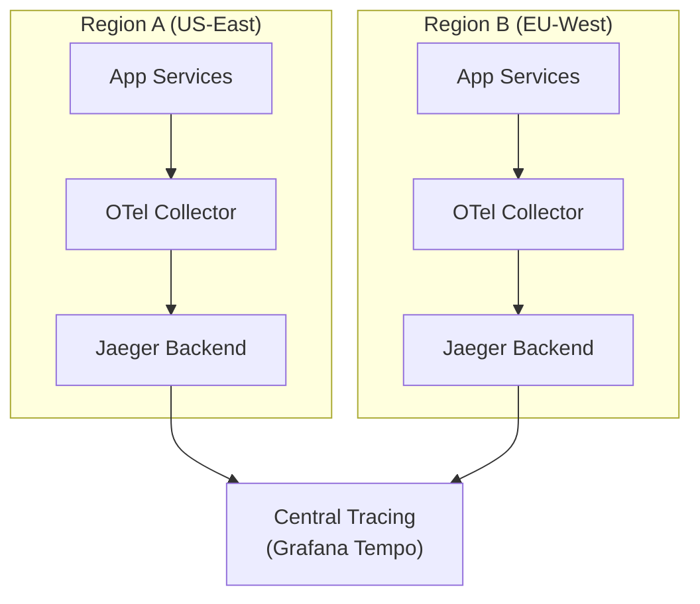
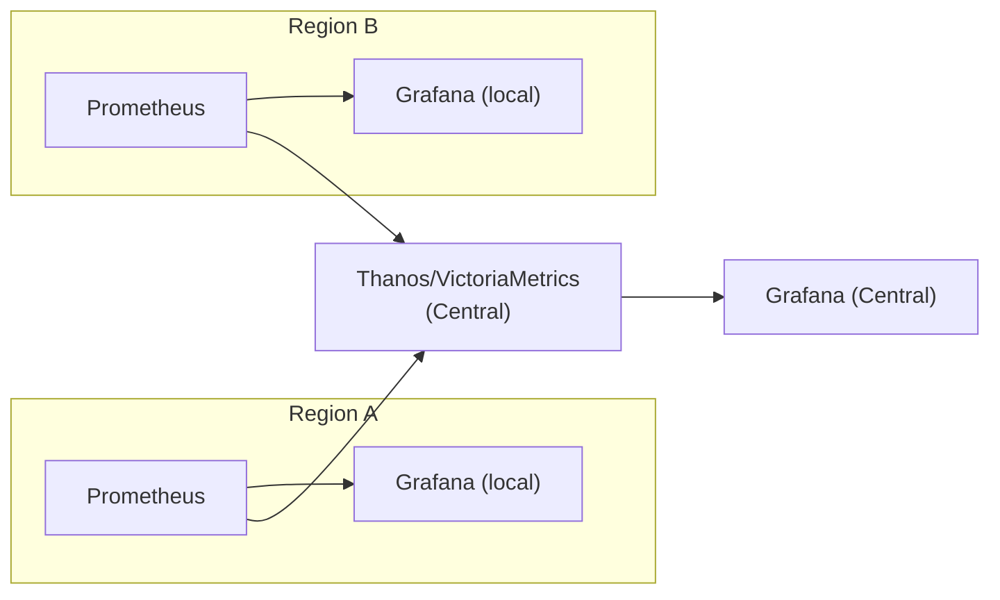

# Testing, Chaos Engineering & Observability

Multi-region systems fail in ways single-region systems don't. Testing and monitoring must evolve accordingly.

---

## Failover Testing Strategies

### Testing Approaches

**Scheduled Failover Drills:** Regularly scheduled tests where a region is intentionally degraded or taken offline. Run monthly or quarterly.

**Progressive Testing:** Start with partial degradation (single service) before testing full region failure.

**Data-Plane vs. Control-Plane:** Test separately — control-plane failures (DNS, routing) differ from data-plane failures (compute, storage).

### Testing Checklist

1. [ ] Regional kill — shut down an entire region, measure time to recovery
2. [ ] Network partition — block traffic between regions, verify split-brain prevention
3. [ ] Replication lag injection — artificially slow replication, verify application handles stale data
4. [ ] Failback test — bring old region back, verify data consistency
5. [ ] Capacity test — send 2x normal traffic to one region, verify it handles the load
6. [ ] Cascading failure test — kill one region, verify others don't overload

### Best Practices

- Start with non-production, graduate to production drills
- Validate data consistency after failover
- Measure RTO/RPO during each drill
- Document failure scenarios with runbooks
- Automate the drill lifecycle: preparation → execution → validation → rollback

---

## Chaos Engineering Tools

| Tool | Type | Best For | Multi-Region |
|------|------|----------|-------------|
| **LitmusChaos** | CNCF, K8s-native | Cloud-native chaos experiments | Multi-cluster via ChaosCenter |
| **AWS FIS** | Managed AWS service | AWS-specific fault injection | Native multi-region |
| **Gremlin** | Commercial | Enterprise chaos platform | Multi-cloud |
| **Chaos Mesh** | CNCF, K8s-native | Network, pod, IO chaos | Multi-cluster |
| **Chaos Monkey** | Netflix OSS | Random instance termination | Single-region |

### LitmusChaos Example — Region Failover Test

```yaml
apiVersion: litmuschaos.io/v1alpha1
kind: ChaosEngine
metadata:
  name: region-failover-test
  namespace: litmus
spec:
  appinfo:
    appns: "production-us-east-1"
    applabel: "app=web-service"
    appkind: "deployment"
  chaosServiceAccount: litmus-admin
  experiments:
    - name: pod-delete
      spec:
        components:
          env:
            - name: TOTAL_CHAOS_DURATION
              value: "300"  # 5 minutes
            - name: CHAOS_INTERVAL
              value: "30"
```

### Key Experiments for Multi-Region

| Experiment | What It Tests |
|-----------|---------------|
| Network partition between regions | Failover behavior when regions can't communicate |
| DNS resolution failure | What happens when routing breaks |
| Region-specific pod/node kill | Traffic rerouting and capacity absorption |
| Latency injection | Timeout and retry logic under degraded conditions |
| Replication path disruption | Data consistency during split |

### Chaos Engineering Best Practices

1. **Game Days:** Quarterly team exercises simulating regional outages end-to-end
2. **Blast Radius Control:** Namespace isolation, node selectors, chaos service accounts
3. **Steady State Hypothesis:** Define expected behavior before injecting chaos
4. **Experiment in Production:** Start in staging, but ultimately test where real failures happen
5. **Monitor During Chaos:** Correlate chaos events with observability data

---

## Distributed Tracing Across Regions

### Architecture



### Tools

| Tool | Type | Multi-Region |
|------|------|-------------|
| **OpenTelemetry** | Instrumentation standard | Vendor-agnostic |
| **Jaeger** | CNCF graduated | Multi-cluster native |
| **Grafana Tempo** | Grafana stack | Native OTLP |
| **Datadog APM** | Commercial | Native multi-region |

### OpenTelemetry Collector Config (Per-Region)

```yaml
receivers:
  otlp:
    protocols:
      grpc:
        endpoint: 0.0.0.0:4317

processors:
  batch:
    timeout: 5s
    send_batch_size: 10000
  resource:
    attributes:
      - key: deployment.region
        value: "us-east-1"
        action: upsert

exporters:
  otlp/jaeger:
    endpoint: jaeger-collector.us-east-1.internal:4317
  otlp/central:
    endpoint: tempo-central.internal:4317

service:
  pipelines:
    traces:
      receivers: [otlp]
      processors: [batch, resource]
      exporters: [otlp/jaeger, otlp/central]
```

### Best Practices
- **Inject correlation IDs** that persist across regions (W3C TraceContext)
- **Tag traces with region metadata:** `deployment.region`, `region.id`
- **Sample smartly:** Parent-based sampling to avoid partial traces
- **Centralize visualization:** Grafana with Tempo/Jaeger backend

---

## Cross-Region Monitoring

### Federation Pattern

Each region runs local Prometheus. Central Thanos/VictoriaMetrics aggregates globally.



### Tools

| Tool | Purpose | Pattern |
|------|---------|---------|
| **Thanos** | Prometheus long-term + multi-cluster | Sidecar per region, global query |
| **VictoriaMetrics** | Prometheus-compatible, multi-tenant | Cluster mode across regions |
| **Datadog** | SaaS observability | Native multi-region |
| **Grafana Cloud** | Managed Grafana stack | Thanos-based |

### Alert Configuration

```yaml
groups:
  - name: multi-region-alerts
    rules:
      - alert: RegionUnhealthy
        expr: up{job="healthcheck"} == 0
        for: 2m
        labels:
          severity: critical
          tier: global

      - alert: CrossRegionReplicationLag
        expr: replication_lag_seconds{source="us-east-1", target="eu-west-1"} > 30
        for: 5m
        labels:
          severity: warning

      - alert: RegionalErrorRateHigh
        expr: |
          rate(http_requests_total{status=~"5.."}[5m])
          / rate(http_requests_total[5m]) > 0.05
        for: 3m
        labels:
          severity: critical
```

### Monitoring Best Practices
1. **Regional independence:** Each region's monitoring works during cross-region outages
2. **Centralized aggregation:** Thanos or similar for global visibility
3. **Cross-region health checks:** Synthetic monitoring from each region to every other
4. **Tiered alerting:** Per-region alerts (local PagerDuty) vs. global alerts (escalation)

---

## SLI/SLO for Multi-Region

### Two Levels of SLOs

| Level | Target | What It Measures |
|-------|--------|-----------------|
| **Per-Region** | 99.9% | Individual region availability |
| **Global** | 99.99% | System availability across all regions |

### SLO Definitions

```yaml
# Per-region availability
availability:
  sli_type: "availability"
  measurement: "count(http_requests_total{status!~'5..'}) / count(http_requests_total)"
  target: 0.999
  window: "rolling-30d"

# Global availability (higher bar)
global_availability:
  sli_type: "availability"
  measurement: |
    sum(rate(http_requests_total{status!~"5.."}[5m])) /
    sum(rate(http_requests_total[5m]))
  target: 0.9999
  window: "rolling-30d"

# Failover latency
failover_slo:
  description: "Region failover completes within 60 seconds"
  target: 0.95  # 95% of failover attempts
  window: "rolling-90d"
```

### Error Budget Policies

| Budget Status | Action |
|---------------|--------|
| Healthy (>50% remaining) | Feature development and deployments allowed |
| Low (20-50%) | Freeze non-critical changes, focus on reliability |
| Exhausted (<20%) | No deployments, only reliability work |

### Burn-Rate Alerting

Alert when the SLO is being consumed faster than the error budget allows:
- **Fast burn:** 2% of 30-day budget consumed in 1 hour → immediate alert
- **Slow burn:** 5% of 30-day budget consumed in 6 hours → warning

### Multi-Region-Specific Metrics

| Metric | Why It Matters |
|--------|---------------|
| Cross-region replication lag | Data consistency risk |
| Failover time (detection + switchover) | RTO validation |
| Regional traffic distribution post-failover | Capacity absorption |
| Data consistency score | Post-failover integrity |
| Error budget burn rate per region | Which region is risky |

---

## Multi-Region-Specific Monitoring Metrics

| Category | Metric | Threshold |
|----------|--------|-----------|
| Replication | `replication_lag_seconds` | Warning: >1s, Critical: >10s |
| Failover | `failover_duration_seconds` | Target: <60s |
| Consistency | `data_consistency_score` | Target: >99.9% |
| Capacity | `region_cpu_utilization_ratio` | Warning: >80%, Critical: >95% |
| Traffic | `cross_region_traffic_ratio` | Alert if one region handles >80% during failover |

---

## Crosslinks

- [[Failure Modes and Recovery]] — The failures these tests simulate
- [[Deployment Topologies]] — Topology determines testing approach
- [[Real-World Case Studies]] — Netflix's Chaos Kong, Uber's production drills
- [[Cost and Trade-offs]] — Cost of monitoring infrastructure
