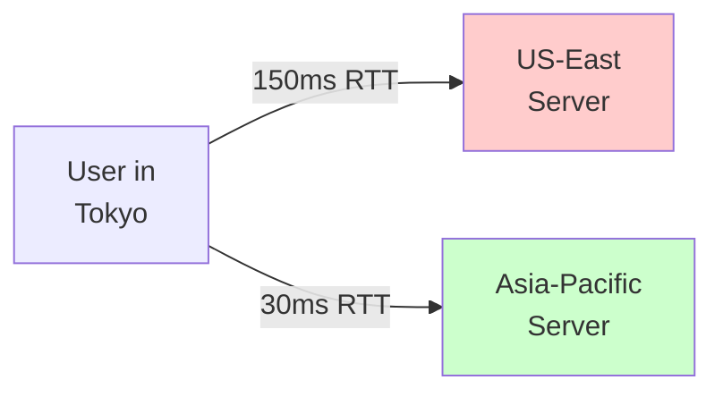
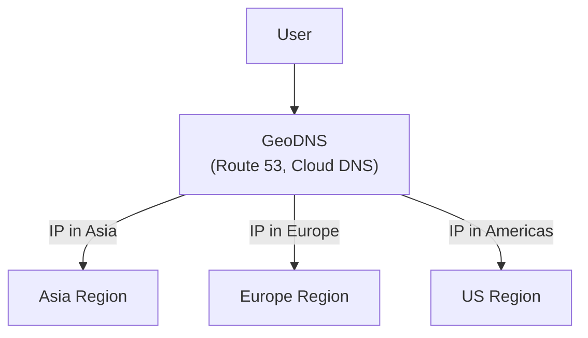
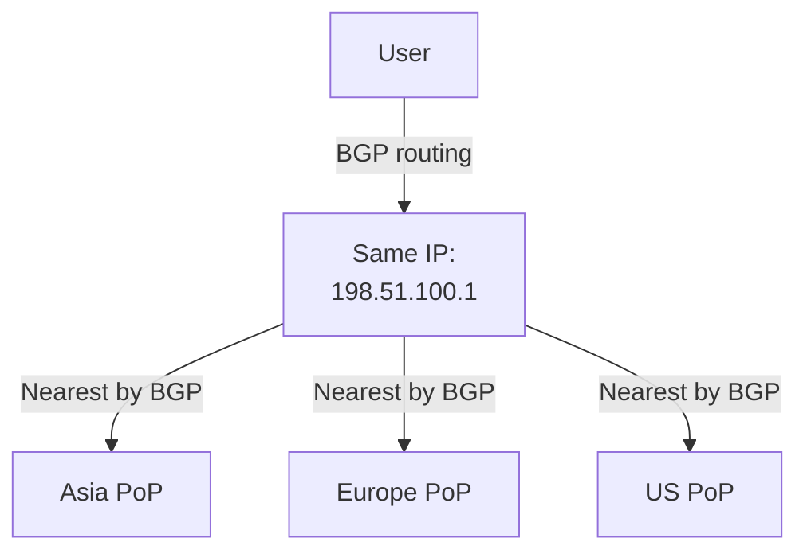
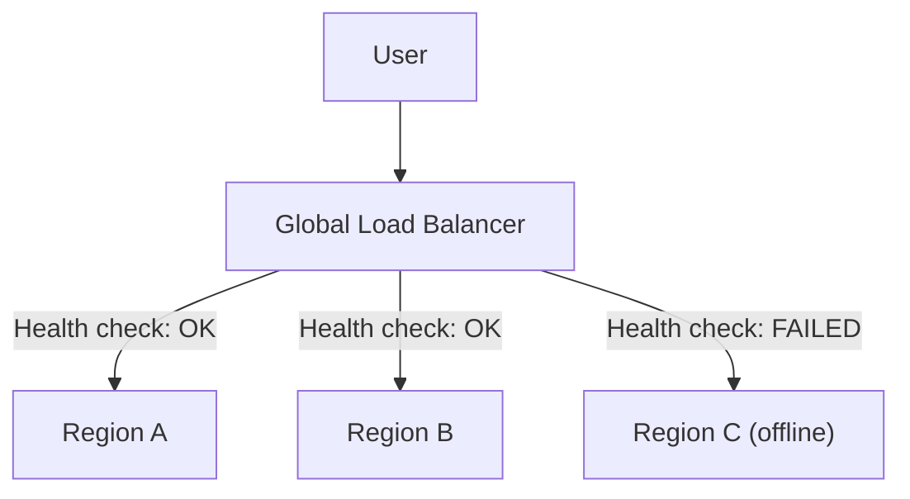
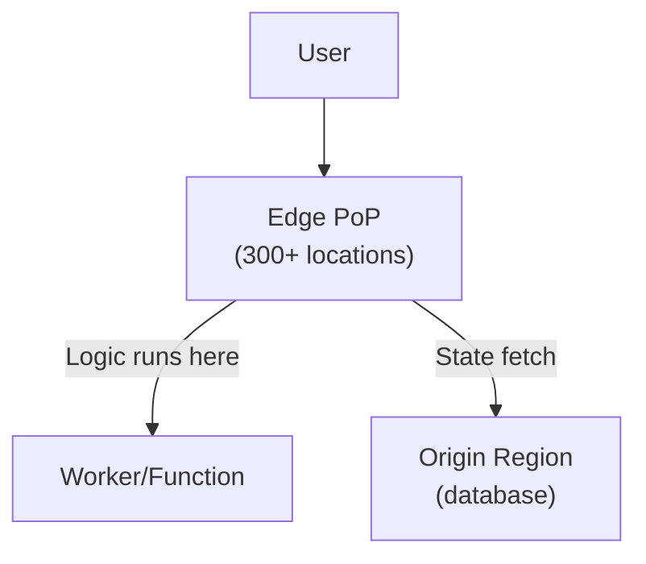

# Traffic Routing and Latency

Getting users to the right region is half the battle. The other half is making it fast.

---

## The Latency Problem

A user in Tokyo connecting to a US-East server experiences ~150ms one-way latency. That's 300ms round-trip for every request. For a page with 100 resources, that adds up fast.



Multi-region solves this by placing compute close to users.

---

## Routing Methods

### 1. GeoDNS

DNS resolves to the nearest region based on client IP geolocation.



**How it works:**
1. Client queries DNS for your domain
2. DNS provider looks up client IP's geographic location
3. Returns IP address of nearest region
4. Client connects to that region

**Pros:**
- Transparent to users — no configuration needed
- Works for any protocol (HTTP, TCP, UDP)
- No extra hop — direct connection to region

**Cons:**
- DNS caching: clients cache the IP (TTL-dependent). Failover takes TTL seconds to minutes.
- No health checking: DNS can't detect if a region is actually serving traffic.
- IP geolocation is approximate — sometimes wrong.
- Can't route based on load or server health.

**TTL trade-off:** Low TTL (30s) = fast failover but more DNS queries. High TTL (300s) = fewer DNS queries but slow failover.

**Providers:** AWS Route 53 (latency-based routing), Google Cloud DNS, Cloudflare DNS.

---

### 2. Anycast

Multiple regions announce the same IP address via BGP. Internet routing sends packets to the nearest.



**How it works:**
- Each region advertises the same IP prefix (e.g., 198.51.100.0/24)
- BGP routers in the internet automatically route to the closest announcement
- When a region fails, BGP withdraws the route and traffic shifts

**Pros:**
- Automatic failover — BGP converges in seconds to minutes
- Lowest latency — truly the nearest path
- No client-side configuration
- Works for any TCP/UDP traffic

**Cons:**
- Requires IP address space (or provider support)
- BGP convergence can be slow (up to 5 minutes)
- Load imbalance — BGP finds "closest" not "least loaded"
- No HTTP-level intelligence (can't route by path or header)

**Used by:** Cloudflare, Google, Akamai, most CDN providers.

---

### 3. Global Load Balancer (Layer 7)

HTTP/HTTPS-level routing with health checks, session affinity, and content-based routing.



**How it works:**
1. Client connects to global LB endpoint (anycast or geo-DNS in front)
2. LB inspects the request (path, headers, cookies)
3. Routes to backend based on routing rules + health status
4. Handles TLS termination, compression, caching

**Routing algorithms:**
- **Round-robin:** Equal distribution, ignores server load
- **Least connections:** Routes to server with fewest active connections
- **Weighted:** Distribute by percentage (canary deployments)
- **Latency-based:** Route to region with lowest measured latency
- **Session affinity:** Sticky sessions via cookies

**Pros:**
- Health-aware: automatically removes unhealthy regions
- Content-based routing: `/api/v2` → Region A, `/static` → CDN
- Fast failover: health checks detect issues in seconds
- Observability: centralized logging and metrics

**Cons:**
- Adds one network hop (usually minimal)
- Provider lock-in — each cloud has their own GLB
- Cost per million requests + data processing

**Providers:** Google Cloud Global Load Balancer, AWS ALB + Route 53, Azure Front Door, Cloudflare Load Balancer.

---

### 4. Edge Compute

Run application logic at 300+ edge locations globally. State lives in origin regions.



**How it works:**
- Code (JavaScript, WASM) deployed to edge nodes worldwide
- Each request handled by the nearest edge node
- Edge can read/write to origin databases for state
- Some operations fully local (auth, transforms, routing)

**Platforms:**
- **Cloudflare Workers:** V8 isolates, 50ms CPU time (free tier), KV, D1, R2
- **Vercel Edge Functions:** Deno-based, deployed to Vercel's edge network
- **Deno Deploy:** V8-based, global by default
- **AWS Lambda@Edge:** Lambda functions on CloudFront

**Pros:**
- Lowest latency — logic runs <50ms from users
- No region management — platform handles global distribution
- Scales to zero — pay per request
- Great for: auth, A/B testing, personalization, API gateways, SSR

**Cons:**
- Limited runtime: 30s-50ms CPU time limits (not for long-running tasks)
- Cold starts on some platforms
- Limited access to underlying infrastructure
- Debugging harder across 300+ locations

---

## Latency Benchmarks

Approximate one-way latency between common regions:

| Route | Latency | Use Case Impact |
|-------|---------|-----------------|
| Same city | 1–5ms | Negligible |
| Same continent (US East ↔ US West) | 30–60ms | Noticeable for real-time |
| Transatlantic (US ↔ EU) | 70–100ms | Significant for interactive apps |
| Transpacific (US ↔ Asia) | 120–180ms | Major impact, needs multi-region |
| US ↔ Australia | 180–220ms | Strong case for edge/CDN |

**Rule of thumb:** If round-trip latency exceeds 200ms, users feel "slowness." If it exceeds 500ms, they leave.

---

## TLS and Certificate Management

Multi-region adds TLS complexity:

### Single Certificate (Recommended)
- One wildcard cert (`.example.com`) or SAN cert
- Deployed to all regions
- Managed via Let's Encrypt or cloud provider
- Renewal coordinated across regions

### Per-Region Certificates
- Each region has its own cert
- More complex renewal
- Useful for region-specific domains (us.example.com, eu.example.com)

### TLS Termination Options
- **At edge/LB:** LB terminates TLS, sends HTTP to origin. Simpler origin setup.
- **At origin:** End-to-end encryption. More secure but requires certs everywhere.
- **mTLS between regions:** Mutual TLS for inter-region replication. Ensures only your regions talk to each other.

---

## Design Patterns

### Latency-Aware Routing

Route not just by geography but by measured latency:

```python
# Pseudocode: Select region with lowest measured latency
def select_region(user_ip, regions):
    scored = []
    for region in regions:
        # Combine geographic distance + real-time latency measurement
        geo_latency = geo_distance(user_ip, region.ip)
        measured = health_check_latency(region)
        score = 0.4 * geo_latency + 0.6 * measured
        scored.append((score, region))
    return min(scored)[1]
```

### Circuit Breaking Between Regions

When a region is slow, don't let it degrade the entire system:

- Track error rates and latency per region
- If region exceeds threshold, stop sending traffic (circuit open)
- Periodically test if region recovers (circuit half-open)
- Resume when healthy (circuit closed)

### Request Coalescing for Replication

When multiple users request the same uncached data:
- First request triggers origin fetch
- Subsequent requests wait for the first (coalesce)
- Prevents thundering herd on region failover

---

## Crosslinks

- [[Deployment Topologies]] — How regions are arranged
- [[Failure Modes and Recovery]] — What happens when routing fails
- [[Designing Data-Intensive Applications]] — Part 06 (Partitioning) for data-level routing

---

## Glossary

| Term | Definition |
|------|------------|
| **GeoDNS** | DNS resolution based on client geographic location, routing to nearest region. |
| **Anycast** | Multiple regions announce the same IP address; BGP routes packets to the nearest. |
| **Global Load Balancer** | HTTP-level router with health checks, session affinity, and content-based routing. |
| **Edge Compute** | Running application logic at 300+ edge locations globally, close to users. |
| **TTL (Time-to-Live)** | How long DNS responses are cached. Lower = faster failover, more DNS queries. |
| **BGP** | Border Gateway Protocol — internet routing protocol used by anycast. |
| **mTLS** | Mutual TLS — both client and server authenticate each other. |
