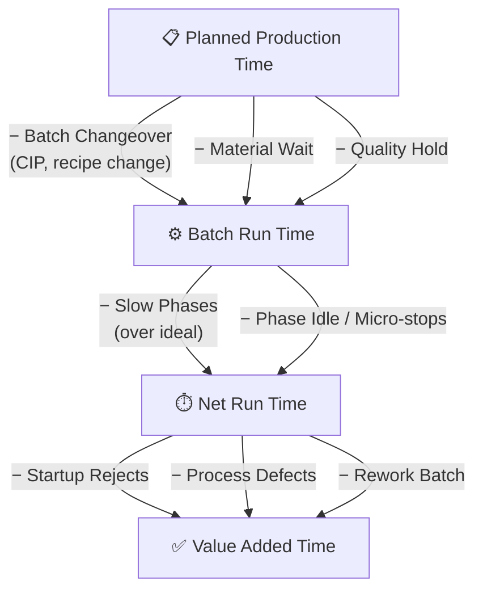

# Batch Phase Tracking — Understanding the Concept

Batch OEE is fundamentally different from continuous OEE. The difference isn't just in the formulas — it's in **how you think about time**.

In continuous production, a machine is either running or stopped. In batch production, a machine goes through **distinct phases**, each with its own purpose, duration, and failure modes. Understanding this distinction is the key to calculating batch OEE correctly.

## 1. What Is a Batch Phase?

A **batch phase** is a distinct stage in the production of a batch, defined by a specific operation. Each phase has:

- **Start trigger** — an event that begins the phase (e.g., "temperature reached 80°C")
- **End trigger** — an event that ends the phase (e.g., "mixing complete signal")
- **Ideal duration** — how long it SHOULD take (from recipe/machine spec)
- **Actual duration** — how long it DID take

> **Key insight:** A batch doesn't just "run" — it progresses through a sequence of phases. Each phase is a separate measurement point for OEE.

### Real-World Example: Seasoning Production

Consider a batch of 500g seasoning packets:

```
Batch Timeline:
├── Setup/Changeover (CIP, recipe change, cleaning)     [20 min]
├── Phase 1: Loading/Charging                            [15 min ideal]
│   └── Idle: waiting for raw materials                  [5 min — material delay]
├── Phase 2: Mixing                                      [30 min ideal]
│   └── Idle: transition to heating                      [3 min — equipment handoff]
├── Phase 3: Heating/Drying                              [45 min ideal]
│   └── Idle: waiting for temp sensor                    [2 min — sensor lag]
├── Phase 4: Cooling                                     [20 min ideal]
│   └── Idle: transition to filling                      [4 min — line changeover]
├── Phase 5: Filling/Packaging                           [25 min ideal]
│   └── Quality Hold: waiting for lab results            [30 min — lab wait]
└── Phase 6: Discharge/Transfer                          [10 min ideal]
```

**Total batch time:** 190 minutes
**Actual production time:** 145 minutes
**Idle + hold time:** 45 minutes

> The **idle time between phases** and the **quality hold** are where OEE losses hide. In continuous production, these would just be "downtime." In batch, they're **specific, measurable, and actionable**.

## 2. Why Phases Matter for OEE

The critical insight: **Performance calculation in batch requires knowing which phase you're in.**

### The Aggregation Trap

Consider this scenario:

| Phase | Ideal Duration | Actual Duration |
|-------|---------------|-----------------|
| Heating | 45 min | 55 min |
| Filling | 25 min | 20 min |

If you only look at **total batch time**: 55+20 = 75 min actual vs 45+25 = 70 min ideal. Looks like only 5 minutes of loss.

But **per-phase performance** tells a different story:

- **Heating:** 45/55 = **81.8% performance** ← problem!
- **Filling:** 25/20 = **125% performance** ← impossible — wrong ideal time

> **Phase-level performance reveals root causes.** Aggregated batch OEE hides them. A value over 100% indicates the Ideal Cycle Time is set too high — a calibration issue, not a performance win.

### Analogy: Cooking a Multi-Course Meal

Think of batch phases like cooking a Thanksgiving dinner:

- **Phase 1:** Prep vegetables (chopping, peeling)
- **Phase 2:** Roast turkey (long, single operation)
- **Phase 3:** Make gravy (depends on turkey drippings)
- **Phase 4:** Plate and serve

Each phase has a **different ideal time**, a **different skill requirement**, and **different failure modes** (burnt turkey vs. lumpy gravy). You can't optimize the meal by just looking at "total cooking time" — you need to know which phase was slow.

## 3. The Batch OEE Waterfall

The standard OEE waterfall adapts for batch:



> **Key difference from continuous:** Batch adds **Batch Changeover**, **Material Wait**, and **Quality Hold** as formal loss categories. These are availability losses specific to batch production.

### Loss Categories Specific to Batch

| Loss | Category | Example |
|------|----------|---------|
| **Batch Changeover** | Availability Loss | Recipe/formula change, CIP cleaning |
| **Material Wait** | Availability Loss | Waiting for ingredients/raw materials |
| **Quality Hold** | Availability Loss | Batch awaiting lab test results |
| **Rework Batch** | Quality Loss | Entire batch reprocessed |
| **Batch Startup Reject** | Quality Loss | First units of new batch |

## 4. Batch OEE Formulas

### Basic Batch Formulas

```
Batch Availability = runDuration / (runDuration + setupDuration)
Batch Performance  = idealDuration / runDuration
Batch Quality      = goodQuantity / quantity
Batch OEE          = Availability × Performance × Quality
```

### Batch-Specific Metrics

| Metric | Formula | What It Tells You |
|--------|---------|-------------------|
| **Batch Yield** | `goodUnits / totalUnits` | How many units passed quality |
| **First Pass Yield** | `firstPassBatches / totalBatches` | No rework needed |
| **Setup Efficiency** | `externalSetup / totalSetup` | SMED effectiveness |
| **Changeover Time** | `endTime - startTime` | How long between batches |
| **Batch Cycle Time** | `runTime / batchQuantity` | Actual production rate per batch |

### Performance Calculation — The Tricky Part

Performance is the hardest factor in batch OEE because batch size varies. Three methods:

**Method 1: Ideal Duration (simpler)**
```
Performance = idealDuration / runDuration
where idealDuration = (batchQuantity × idealCycleTimePerUnit)
```

**Method 2: Ideal Cycle Time × Total Count (standard)**
```
Performance = (idealCycleTime × batchQuantity) / netRunTime
```

**Method 3: Phase-based (most accurate for complex recipes)**
```
Performance = Σ(idealPhaseTime_i) / Σ(actualPhaseTime_i)
for each phase i in the batch recipe
```

> **Critical:** Use **design speed / ideal cycle time** from the recipe or machine spec, NOT historical average. Using standard speed places a false upper limit on improvement.

## 5. Aggregation — Per-Batch to Shift/Line/Plant

Individual batch OEE scores must be aggregated to shift, line, or plant level. The method matters.

### Weighted Average by Duration (Recommended)

```
Line OEE = Σ(batchOEE_i × batchDuration_i) / Σ(batchDuration_i)
```

### Weighted Average by Quantity

```
Line OEE = Σ(batchOEE_i × batchQuantity_i) / Σ(batchQuantity_i)
```

> **Never use simple average** of batch OEE scores — a 2-hour batch and a 30-minute batch should not have equal weight.

### When to Use Which

| Situation | Method |
|-----------|--------|
| Comparing batches of same product | Weighted by duration |
| Capacity planning | Weighted by quantity |
| Revenue analysis | Weighted by batch value |

## 6. Batch-Specific Pitfalls

1. **Measuring downstream idle equipment** — Apply Theory of Constraints: measure OEE at the bottleneck only. Don't measure OEE on every idle downstream machine.

2. **Wrong cycle time target** — Use historical best-performing batch as surrogate for ideal when design specs are unavailable.

3. **Ignoring phase-level breakdown** — Aggregated batch OEE doesn't reveal WHICH phase is the bottleneck. Drill into phase durations to find root causes.

4. **Overlapping downtime events** — Batch processes often have simultaneous events (e.g., maintenance during quality hold). Correctly attribute each to avoid double-counting.

5. **Quality timing lag** — Lab results may come hours after batch completion. Quality hold time counts as availability loss until released.

6. **Batch startup reject scope** — Startup rejects occur AFTER EACH changeover, not just daily startup. In pharma with frequent recipe changes, this can be significant.

7. **Equipment dependency** — In batch lines, equipment A feeding B feeding C creates cascading idle time. Measure the constraint, not every machine.

## 7. Real-World Results

| Case | Result | Source |
|------|--------|--------|
| **Glanbia (food)** | 10% OEE improvement in 6 weeks, +0.4–1.4% yield, −8% energy | Industry case study |
| **Chemical manufacturer** | 300 extra batches/year from 10-min improvement per batch ($20K–$50K/batch value) | Seeq case study |
| **Pharma tablet press** | Phase-level monitoring identified ejection arm lubrication as root cause for 9.4% OEE drop | Industry case study |

> **Key insight:** Shaving even a small amount of time from a phase results in more batches per day. 10 batches/day at 144 min each → improve by 10 min → 10.7 batches/day → ~300 extra batches/year.

## 8. Glossary

| Term | Definition |
|------|------------|
| **Batch Phase** | A distinct stage in batch production, defined by a specific operation (mixing, heating, cooling, filling). Each has start/end triggers, ideal duration, and actual duration. |
| **Phase Transition** | The event marking the end of one phase and the beginning of the next. Detected from PLC signals, sensor thresholds, or operator input. |
| **Ideal Duration** | The time a phase SHOULD take, based on recipe specifications or machine design speed. |
| **Actual Duration** | The time a phase DID take, measured from phase start trigger to phase end trigger. |
| **Phase Idle** | Time between phases when the machine is not performing any productive operation. |
| **Batch Changeover** | Setup time between batches — includes CIP, recipe changes, equipment cleaning. |
| **Quality Hold** | Time when a completed batch is waiting for lab test results before being released. |
| **Startup Reject** | Defective units produced at the start of a new batch, before steady state. |
| **Recipe** | The set of instructions defining how to produce a batch — phase sequence, ideal durations, parameters, quality criteria. |
| **CIP (Clean-In-Place)** | Automated cleaning process between batches, common in food/pharma. |
| **First Pass Yield (FPY)** | Percentage of batches that pass quality inspection on the first attempt, without rework. |

## Related

- [[OEE — Overall Equipment Effectiveness]] — The base formula and waterfall
- [[Manufacturing Types]] — How batch compares to discrete, continuous, HMLV
- [[Calculation Methods]] — Detailed calculation approaches
- [[Mistakes and Hidden Factory]] — Common errors and untapped capacity
- [[Improvement Strategies]] — What to do after finding the problems
