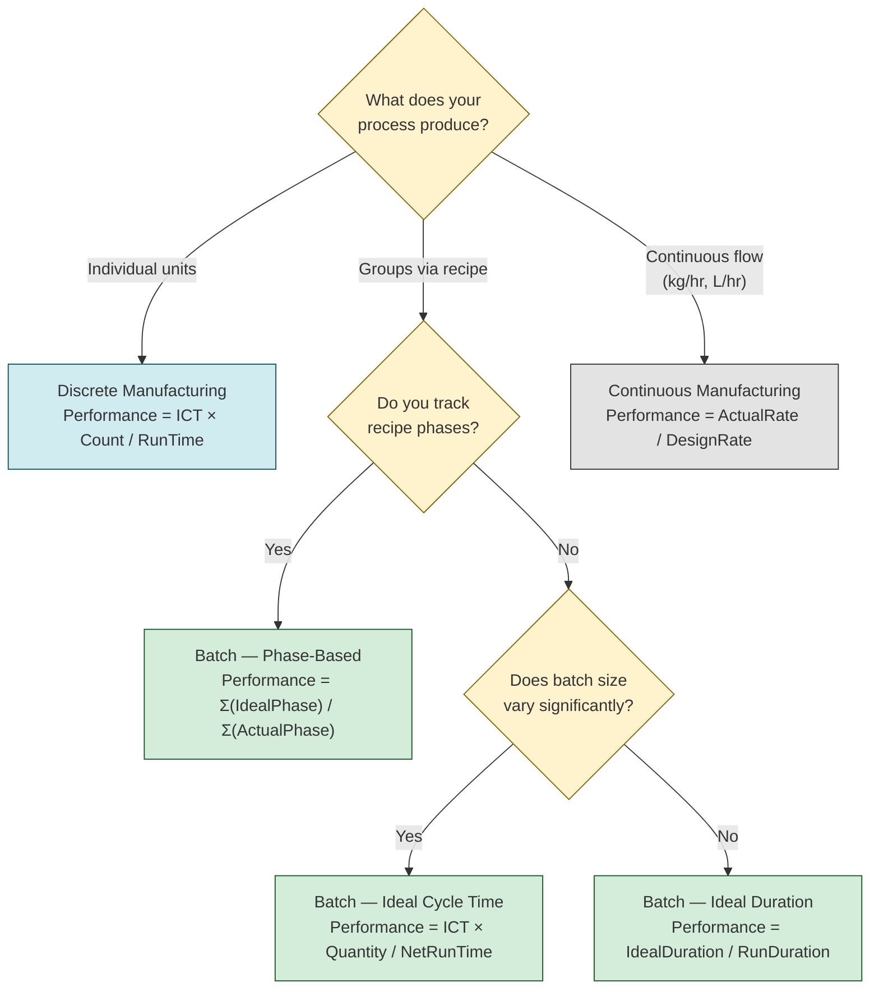

# 2. OEE Calculation Methods

There isn't one way to calculate OEE. There are several, and choosing the wrong one produces numbers that look precise but mean nothing.

## Which Formula Should I Use?



> **Tip:** When in doubt, use Method 2 (Ideal Cycle Time × Total Count). It works for most batch and discrete processes.

## The Two Formulas

### Simple (Single Calculation)

```
OEE = (Good Count × Ideal Cycle Time) / Planned Production Time
```

This gives you a number. It tells you nothing about *where* the losses are. **Limited diagnostic value.** You get a score but no idea where to improve.

### Preferred (A × P × Q) — Always Use This

```
OEE = Availability × Performance × Quality
```

This gives you a score AND the three loss factors to target improvement. **Always prefer this.** The decomposition is the entire point of OEE.

> **Developer opinion:** If your system only stores a single OEE number, you've built a dashboard, not a diagnostic tool. Store A, P, Q separately. Store the raw counts. Store the timestamps. You'll need them.

## Performance Calculation — The Tricky Part

Performance is where most OEE implementations get it wrong. It's the most nuanced factor and the one most likely to produce misleading numbers.

### Standard Formula
```
Performance = (idealCycleTime × totalCount) / runTime
```

**Example:**
- Ideal Cycle Time: 0.5 min/unit (design speed = 2 units/min)
- Total Count: 800 units
- Run Time: 420 min
- Performance = (0.5 × 800) / 420 = **95.2%**

### What Can Go Wrong

**Performance > 100%:** This happens when the machine runs faster than its nominal rated speed. It means your Ideal Cycle Time is set too high (or design speed is wrong). This inflates OEE and masks losses.

> **Rule:** If Performance exceeds 100%, update the Ideal Cycle Time. A well-calibrated system should never exceed 100%.

**Using historical average instead of design speed:** If the machine was designed to run at 100 units/min but averages 80, using 80 as the target says "we can't improve." Always use design speed from the machine spec.

**Run Time = 0 edge case:** If the machine never ran (full shift downtime), Performance is undefined (division by zero). Your system should return 0% or null — not crash. This happens more often than you'd think during commissioning or extended breakdowns.

**Partial counts:** What if you count 800 units but 50 are reworked? totalCount = 800 (all produced), goodCount = 750 (first-pass good). Quality uses goodCount. Performance uses totalCount. Don't confuse them.

### Data Model Hint

Store these raw values — never just the calculated percentages:

```sql
CREATE TABLE oee_record (
  machine_id       TEXT,
  shift_id         TEXT,
  product_variant  TEXT,
  planned_time     INTERVAL,   -- planned production time
  run_time         INTERVAL,   -- actual running time
  ideal_cycle_time DECIMAL,    -- per unit, from machine spec
  total_count      INTEGER,    -- all parts produced
  good_count       INTEGER,    -- first-pass good parts
  downtime_events  JSONB,      -- array of {start, end, reason_code}
  -- Calculated fields (store for query speed, but always recompute for accuracy)
  availability     DECIMAL,
  performance      DECIMAL,
  quality          DECIMAL,
  oee              DECIMAL
);
```

> **Why store downtime_events as JSONB?** Because the "why" changes over time. You'll want to reclassify downtime reasons later when your taxonomy improves. Raw events give you that flexibility.

## Batch Performance — Three Methods

Batch manufacturing makes Performance calculation harder because batch size varies.

### Method 1: Ideal Duration (Simpler)
```
Performance = idealDuration / runDuration
where idealDuration = (batchQuantity × idealCycleTimePerUnit)
```

### Method 2: Ideal Cycle Time × Total Count (Standard)
```
Performance = (idealCycleTime × batchQuantity) / netRunTime
```

### Method 3: Phase-Based (Most Accurate for Complex Recipes)
```
Performance = Σ(idealPhaseTime_i) / Σ(actualPhaseTime_i)
for each phase i in the batch recipe
```

> **When to use which:** Method 1 for simple batches. Method 2 for most cases. Method 3 when you have recipe phases (mixing, heating, cooling) and need to know which phase is the bottleneck.

See [[Manufacturing Types]] for how batch processes differ from continuous.

## Continuous / Process Performance

No unit count — measured against design rate:

```
Performance = actualRate / designRate
Quality     = goodOutput / totalOutput
```

Output is flow rate (kg/hr, L/hr, tonnes/day). No cycle time — just rate against design capacity.

## Aggregation — The Hierarchy Trap

How do you combine machine-level OEE into line-level or plant-level numbers?

### Weighting Methods

| Method | Formula | When to Use |
|--------|---------|-------------|
| **By Duration** | `Σ(OEE_i × duration_i) / Σ(duration_i)` | Shift/plant aggregation |
| **By Quantity** | `Σ(OEE_i × quantity_i) / Σ(quantity_i)` | Volume comparison |
| **Constraint-Based** | `actualOutput / bottleneckCapacity` | Sequential lines |

### The Rules

1. **Never use simple average** when batches or shifts have different durations
2. **Sequential lines** (assembly): Use constraint-based, not weighted average
3. **Parallel lines** (independent): Weighted average works
4. **Batch processes**: Weight by batch duration, not quantity

### Concrete Example: Why Simple Average Fails

Machine A ran 6 hours, OEE = 90%. Machine B ran 2 hours, OEE = 50%.

**Simple average:** (90 + 50) / 2 = **70%** — looks decent.

**Duration-weighted:** (90×6 + 50×2) / (6+2) = **80%** — Machine A ran 3× longer, so it dominates.

The simple average makes Machine B's problems look worse than they are relative to total output. The weighted average correctly reflects that most production came from Machine A.

### Concrete Example: Sequential Lines

3 stations in series: Station A (95% OEE), Station B (88% OEE), Station C (92% OEE).

**Weighted average:** (95 + 88 + 92) / 3 = **91.7%** — looks great.

**Constraint-based:** If Station B is the bottleneck at 88%, line throughput is capped at 88% regardless of what A and C do. Improving A to 100% doesn't help — parts just pile up before B.

> **The core insight:** Hierarchy does not apply uniformly. A 2-hour batch and a 30-minute batch should not have equal weight. A line with 5 sequential stations should not be averaged — the bottleneck determines throughput.

> **For developers:** Your aggregation logic should be configurable per line. Don't hardcode one method. Let the manufacturing engineer choose: duration-weighted, quantity-weighted, or constraint-based. Store the method used so results are reproducible.

## Loss Perspectives

Losses can be viewed from three angles:

1. **Part Units:** "We lost 1,000 units of potential production" (sales/capacity perspective)
2. **Time Units:** "We lost 2 hours of production" (labor/utilization perspective)
3. **Percentage:** "We lost 17% of Planned Production Time" (manufacturing performance perspective)

> **For developers:** Store all three. Different stakeholders ask different questions. The CEO wants part units. The shift supervisor wants time. The OEE system should answer all three from the same underlying data.

## The OEE Drop

> **Critical warning:** Switching from manual Excel tracking to automatic measurement, OEE typically **drops 8–15 percentage points** in the first 1–2 weeks. Manual values are systematically higher than reality because operators guess, round, and miss minor stops.
>
> *Source: Symestic (2026) — "Manual values are systematically 8–12 percentage points higher than reality." Evocon (2023) — automatic measurement reveals OEE <40% when first deployed.*

This is NOT worse performance — it's accurate measurement revealing real losses that were previously invisible.

**Rules:**
- Measure automatically for **4+ weeks** before comparing to benchmarks
- Never compare newly measured automatic OEE to mixed manual/automatic benchmarks
- Your first real baseline WILL look worse. That is correct.

## Related

- [[OEE — Overall Equipment Effectiveness]]
- [[Manufacturing Types]]
- [[Mistakes and Hidden Factory]]
