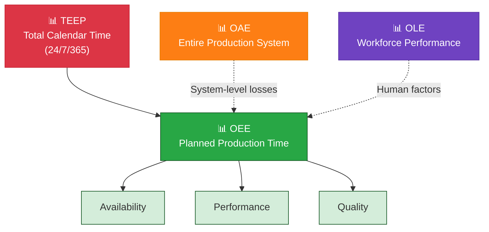

# 6. Extended Metrics

OEE has blind spots — it doesn't capture total utilization, system-level losses, or workforce performance. These metrics fill those gaps.



> **Think of it this way:** OEE tells you how well the machine runs when it's supposed to. TEEP tells you how much of the calendar you're actually using. OAE tells you if the whole system is working. OLE tells you if the people are effective.

## TEEP — Total Effective Equipment Performance

Extends OEE by including ALL calendar time (24/7/365), not just planned production time.

```
TEEP = OEE × (Planned Production Time ÷ Total Calendar Time)
     = Availability × Performance × Quality × Loading
where Loading = Planned Time ÷ Calendar Time
```

**Example:** Machine with 85% OEE running 16 of 24 hours/day:

```
TEEP = 0.85 × (16 ÷ 24) = 56.7%
```

→ 43% of calendar capacity is unused.

> **Key insight:** High OEE + low TEEP = **capacity utilization problem**, not efficiency problem. Check TEEP before investing in new machinery.

## OAE — Overall Asset Effectiveness

Broadens focus from single machine to entire production system, including organizational losses (material delays, logistics, planned maintenance).

```
OAE = Actual Output ÷ Maximum Possible Output (based on total operating time)
```

> **Key insight:** OAE answers: *"How effectively are we using our total asset base?"* — serves plant leadership and management.

## OLE — Overall Labor Effectiveness

Applies OEE logic to human performance, capturing training, experience, and motivation factors.

```
OLE = Availability × Performance × Quality
```

| OLE Factor | Measures |
|------------|----------|
| **Availability** | % of scheduled time operator is present and working |
| **Performance** | % of standard tasks completed per unit time |
| **Quality** | % of operator-initiated tasks completed correctly |

> **Key insight:** Two lines with identical OEE can have different economic results due to team performance. OLE is especially relevant in **manual operations** (assembly, packaging, inspection).

## Which Metric for Which Question?

| You Want to Know | Use This Metric |
|-------------------|-----------------|
| Why is Machine X producing below target? | **OEE** |
| Do we need a new machine — or can we run more shifts? | **TEEP** |
| Why does the line underperform despite good machine OEE? | **OAE** |
| Why does Shift A produce 15% more than Shift B? | **OLE** |
| What is the true cost per good unit? | **TEEP** (includes all losses) |

## Related

- [[OEE — Overall Equipment Effectiveness]]
- [[Improvement]]
