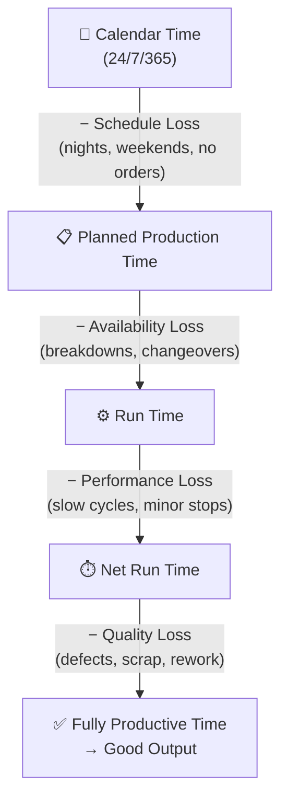
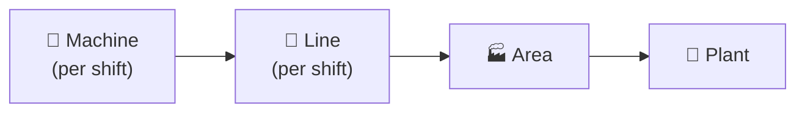

# 1. OEE — Overall Equipment Effectiveness

**OEE measures how close a factory gets to perfect production.** Not how busy it looks. Not how many hours the lights are on. How many *good parts* came out, at *full speed*, with *zero downtime*.

That's the promise. The reality is messier.

## The Formula

```
OEE = Availability × Performance × Quality
```

| Factor | Formula | What It Actually Measures |
|--------|---------|--------------------------|
| **Availability** | `runTime / plannedProductionTime` | Did the machine stop when it shouldn't have? |
| **Performance** | `(idealCycleTime × totalCount) / runTime` | Did it run as fast as it should have? |
| **Quality** | `goodCount / totalCount` | Were the parts actually good? |

Each factor captures a different *kind* of loss. Together they tell you how much of your theoretical capacity turned into revenue.

## The Time Waterfall

Every second of calendar time flows through this waterfall. Losses accumulate at each level:



> **For developers:** This waterfall is your data model. Each transition is a state change. Your system needs to track *when* each transition happened and *why*. The "why" is where the real value lives.

## World-Class Targets

| Factor | Target |
|--------|--------|
| Availability | 90% |
| Performance | 95% |
| Quality | 99.9% |
| **OEE** | **85%** |

**Origin:** Seiichi Nakajima, *Introduction to TPM* (1984). Companies winning Japan's Distinguished Plant Prize for TPM had OEE exceeding 85%.

**The math reality check:** Achieving 90% in ALL three factors yields only **73% OEE** (0.9³). The 85% target requires near-perfection in at least one factor. Most manufacturing companies average **55–60% OEE**. Sustained 85%+ is achieved only by the **top 5–10% of plants**.

> *Source: Evocon (2023) — "Most manufacturing organizations' OEE scores are closer to 55-60%." Symestic (2026) — "80-85% world-class, sustained only by the top 5–10% of plants."*

> **Developer opinion:** Don't treat 85% as a universal target. It was derived from specific Japanese automotive plants in the 1980s. Your context matters more — see [[Manufacturing Types]].

## Why OEE Matters Financially

Every percentage point of OEE translates directly to capacity:

- **1% OEE improvement = 1% additional production capacity** (PreventiveHQ)
- A 10-point OEE gain (65% → 75%) = **15.4% capacity increase** (Oxmaint OEE ROI Calculator)
- Improving from 60% to 80% = **33% more capacity** without capital investment (PreventiveHQ)
- In Leanscape projects, OEE improvements of 5–15 percentage points yielded **annual savings in the range of €100K–€500K** depending on line value

> *Source: PreventiveHQ — "Each 1% OEE improvement = 1% additional production capacity." Oxmaint — "A 10-point OEE gain from 65% to 75% = 15.4% capacity increase." Leanscape — "OEE improvements of 5–15 percentage points have yielded annual savings in the range of..."*

> **For developers:** When building dashboards, always show the financial equivalent. "OEE improved 3%" means nothing to a CFO. "We recovered $300K in capacity this quarter" means everything.

## The Hierarchy Problem



This looks clean. It's not.

**Hierarchy does not apply uniformly.** Not every concept works the same way across all situations:

- Aggregation methods depend on your manufacturing type
- Weighting by duration works for shifts, fails for batch processes
- Averaging station OEE for a sequential line is **mathematically wrong**
- Plant-level OEE can hide machine-level problems

> **The core insight:** OEE is not one number that means the same thing everywhere. How you calculate, aggregate, and interpret it depends entirely on context. See [[Calculation Methods]] for the details.

## Quick Rules

1. **Never look at OEE alone** — always check A, P, Q individually
2. **Use design speed**, not historical average, for Ideal Cycle Time
3. **First Pass Yield** — reworked parts count as quality loss
4. **Performance > 100%** means your Ideal Cycle Time is wrong
5. **Compare similar processes only** — don't benchmark dissimilar lines

## Reading Order

This knowledge base is designed to be read in order. Each section builds on the previous one:


1. [[OEE — Overall Equipment Effectiveness|1. OEE Concept]] — What it is, the formula, world-class targets
2. [[Calculation Methods|2. Calculation Methods]] — Multiple ways to calculate, and why it matters
3. [[Manufacturing Types|3. Manufacturing Types]] — How context changes everything
4. [[Mistakes and Hidden Factory|4. Mistakes and Hidden Factory]] — Where the real value is
5. [[Improvement|5. Improvement]] — What to do after you find the problems
6. [[Extended Metrics|6. Extended Metrics]] — TEEP, OAE, OLE — when OEE isn't enough

> **Tip:** If you're building an OEE system, read 1–3 first. If you're debugging bad OEE numbers, skip to 4. If you need to justify OEE investment, start with the financial section above.

---

*Source: Seiichi Nakajima (TPM), Evocon (3,500+ machines, 50+ countries), industry benchmarks.*
