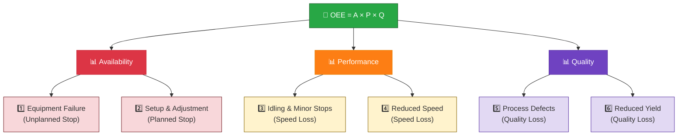

# 4. Mistakes and Hidden Factory

This is where the real value is. Not in the formula — everyone knows the formula. In understanding what goes wrong and what's hiding in plain sight.

## The Six Big Losses

The Six Big Losses framework categorizes all production losses into three groups that map directly to the [[OEE — Overall Equipment Effectiveness#The Formula|OEE formula]].

| # | Loss | Category | OEE Factor |
|---|------|----------|------------|
| 1 | Equipment Failure | Unplanned Stop | Availability |
| 2 | Setup & Adjustment | Planned Stop | Availability |
| 3 | Idling & Minor Stops | Speed Loss | Performance |
| 4 | Reduced Speed | Speed Loss | Performance |
| 5 | Process Defects | Quality Loss | Quality |
| 6 | Reduced Yield | Quality Loss | Quality |



### Availability Losses — When Equipment Stops

**1. Equipment Failure (Unplanned Stop)**

Significant downtime due to failure or unplanned event.

- Tooling failure, breakdowns
- Unplanned maintenance
- Lack of operators or materials
- Starved/blocked by upstream/downstream

> **Threshold:** Downtime > 2 min = Equipment Failure; ≤ 2 min = Minor Stop. This threshold is arbitrary but widely used. Set it based on your process — a 30-second stop on a 10-second cycle is catastrophic; on a 10-minute cycle, it's noise.

**2. Setup & Adjustment (Planned Stop)**

Downtime due to changeover or adjustment.

- Changeovers (make ready)
- Major adjustments
- Cleaning, warmup
- Planned maintenance

> **Developer note:** Setup time is "planned" in the schedule — but it's still an availability loss. Don't let your system classify changeovers as "planned downtime" and exclude them from OEE. That's hiding the loss, not managing it.

### Performance Losses — When Equipment Runs Slow

**3. Idling & Minor Stops**

Short stops (1–2 min) resolved by operator without maintenance.

- Misfeeds, material jams
- Obstructed flow
- Incorrect settings
- Misaligned sensors
- Periodic quick cleaning

> **Key insight:** Minor stops are chronic and often overlooked but accumulate significantly. Most companies don't track them accurately. A machine that stops for 30 seconds every 5 minutes loses 10% of its time — but nobody notices because each stop is "minor."

**4. Reduced Speed**

Running slower than Ideal Cycle Time.

- Dirty/worn equipment
- Poor lubrication
- Substandard materials
- Operator inexperience
- Startup/shutdown periods

### Quality Losses — When Parts Don't Meet Spec

**5. Process Defects**

Defective parts during **stable (steady-state) production** — includes scrap AND rework.

> **OEE uses First Pass Yield** — reworked parts count as quality loss. This is intentional. Rework costs time, labor, and materials. Hiding it inflates OEE.

- Incorrect settings
- Operator errors
- Lot expiration

**6. Reduced Yield**

Defective parts from **startup until stable production** — most common after changeovers.

- Suboptimal changeovers
- Incorrect settings
- Equipment warmup cycles
- Inherent startup waste

## The Hidden Factory

The **Hidden Factory** is the untapped production capacity that can be unlocked **without capital investment**. Coined by Armand Feigenbaum (late 1970s), originally focused on quality waste, now covers all manufacturing waste.

```
Fully Productive Time = Good Pieces × Ideal Cycle Time
Hidden Factory Time  = All Time (24/7) − Fully Productive Time
```

For many manufacturers, **the hidden factory is larger than actual output.**

### The Four Loss Zones

**1. Schedule Loss** (often largest for 1–2 shift operations)

Time not scheduled for production. The biggest lever here is better scheduling — not equipment improvement. If you're running 1 shift but have capacity for 3, your hidden factory is enormous.

**2. Availability Loss** (largest during scheduled time)

Downtime from equipment failure and changeovers.

**3. Performance Loss** (often hidden)

Small stops and slow cycles that go unnoticed. This is the hardest to measure and the most frequently underestimated.

**4. Quality Loss** (smallest but highest customer risk)

Defects, rework, scrap. Small by percentage, but the customer impact is disproportionate.

> **Developer opinion:** Your system should surface the Hidden Factory metric prominently. It's more motivating than OEE alone. When operators see that 60% of their time is "hidden factory," the urgency becomes real.

## Common OEE Mistakes

These mistakes lead to misleading OEE numbers that don't reflect real performance. Each one has a specific signature you can detect in your data.

### 1. Misclassifying Stops as "Planned"

Changeovers and setup are **availability losses**, not acceptable downtime. Classifying them as "planned" inflates OEE and hides improvement opportunities.

> Setup time is planned in the schedule — but it's still a loss that reduces OEE. Your system should track "planned" vs "unplanned" separately, but both should count against Availability.

**How to detect:** If your Availability is consistently >95% but you have 45-minute changeovers every 2 hours, someone is classifying changeovers as "planned" and excluding them. Check your downtime reason taxonomy — "planned maintenance" and "changeover" should be separate categories, and both should reduce Availability.

### 2. Excluding Operators

Operators have the **deepest machine knowledge**. Excluding them from data collection and improvement efforts leads to:
- Poor data quality (guessing instead of measuring)
- No buy-in for improvement initiatives
- Missed root causes

**How to detect:** Look at your downtime reason codes. If you see "Other" or "Unknown" as the top reason, operators aren't engaged. If you see the same generic reason for every stop, they're filling in forms, not diagnosing problems.

### 3. Using Standard Speed Instead of Design Speed

Historical average speed places a **false upper limit** on improvement. If the machine was designed to run at 100 units/min but averages 80, using 80 as the target says "we can't improve."

**Always use design speed** (Ideal Cycle Time from spec) for Performance calculations.

**How to detect:** If your Performance is consistently >95% but output is clearly below capacity, your Ideal Cycle Time is too generous. Cross-check against the machine spec sheet.

### 4. Insufficient Data Collection

Manual/paper-based monitoring is error-prone:

- Operators guess downtimes
- Minor stops go unrecorded
- Cycle times are rounded or estimated
- Quality data is batched, not real-time

**The fix:** Automate data collection. See [[Improvement#Automated Data Collection]].

**How to detect:** If your OEE numbers are suspiciously round (exactly 70%, exactly 85%), someone is estimating. Real OEE numbers have decimals. If your minor stop count is zero but operators report "the machine stops a lot," you're not capturing micro-stops.

### 5. Focusing Only on OEE Score

Looking at the single OEE number without examining A, P, Q individually:

- Two lines with same OEE can have completely different loss profiles
- Improvement actions depend on WHICH factor is weakest
- OEE can stay flat while one factor drops and another rises

**Concrete example:**
- Line A: A=80%, P=95%, Q=99% → OEE = 75.2% (availability problem)
- Line B: A=95%, P=80%, Q=99% → OEE = 75.2% (performance problem)

Same OEE. Completely different fixes. Line A needs maintenance improvements. Line B needs speed optimization.

### 6. Performance > 100%

Performance exceeding 100% means the **Ideal Cycle Time is set too high** (or design speed is wrong). This inflates OEE and masks real losses.

> If machines consistently run faster than spec, update the Ideal Cycle Time. Don't let a flattering number hide a configuration error.

**How to detect:** Query your data for Performance values >100%. If you find any, the Ideal Cycle Time needs updating. This is a configuration error, not a achievement.

### 7. Assuming 100% Quality

Without real-time quality tracking, quality is often **guessed** — and usually guessed optimistically. Inline sensors and vision systems provide actual data.

**How to detect:** If Quality is exactly 100% for days or weeks, someone is not measuring. Real quality is never perfect. If your quality data comes from end-of-line inspection only, you're missing mid-process defects.

### 8. Setting One Target for All Lines

Different products, complexities, and batch sizes produce different OEE profiles. A line making 10 products should naturally have lower OEE than a single-product line due to changeover losses — **this is expected and correct.**

> **Developer opinion:** Your system should let users set different targets per line, per product family, per shift. A single global target is a management fantasy, not a engineering reality.

**How to detect:** If one line always "fails" and another always "succeeds," check whether they're making the same products with the same complexity. Different lines need different baselines.

## The OEE Audit Checklist

When reviewing an OEE system, check these in order:

1. **Ideal Cycle Time source** — Is it from the machine spec, or from historical average?
2. **Downtime classification** — Are changeovers counted as availability loss?
3. **Minor stop capture** — Are stops <2 minutes being recorded?
4. **Quality source** — Is it real-time (inline sensor) or end-of-line (manual inspection)?
5. **Aggregation method** — Is it simple average, weighted, or constraint-based?
6. **Targets** — Are they per-line or global?
7. **Data collection** — Manual or automatic?
8. **Historical comparison** — Are you comparing manual to automatic data?

> **For developers:** Build this audit into your system as a diagnostic tool. When a user says "our OEE doesn't look right," run through this checklist programmatically. Surface the most likely issues.

## Related

- [[OEE — Overall Equipment Effectiveness]]
- [[Calculation Methods]]
- [[Manufacturing Types]]
- [[Improvement]]
