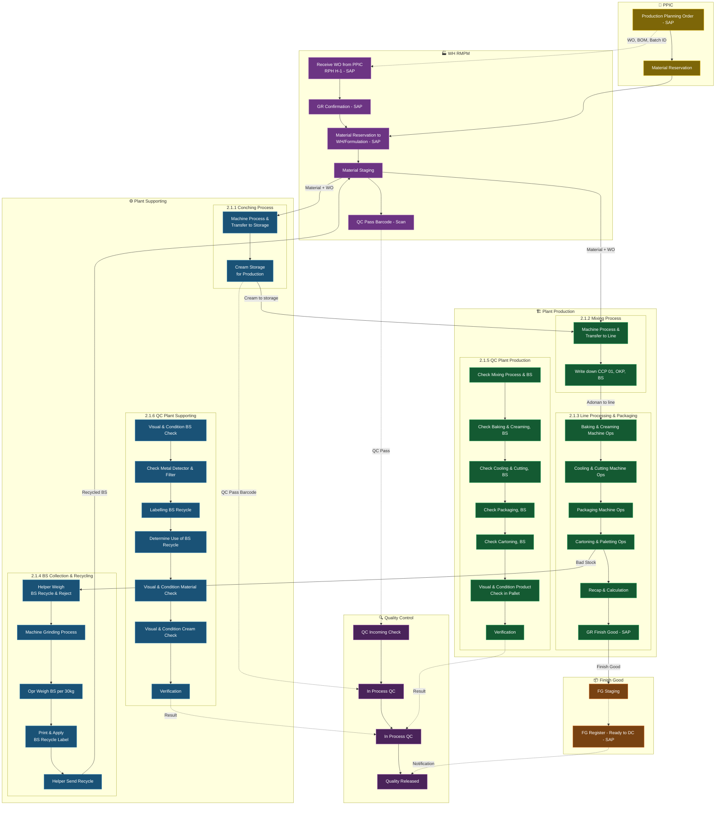

# Nabati MES Ecosystem — Part A: Pemetaan Proses As-Is

**Referensi URS:** Bagian 2 — Proses As-Is & Kebutuhan Pengguna
**Ruang Lingkup:** PT KSNI Plant Majalengka, Gedung A Sektor 8

---

## 2.1 Pemetaan Proses Manufaktur: As-Is

Kondisi saat ini masih mengandalkan formulir kertas manual dan Excel untuk perhitungan dan rekap. Alur dimulai dari PPIC yang menerbitkan Work Order melalui SAP, dilanjutkan ke proses Conching, Mixing, Line Processing & Packaging, hingga FG Staging sebelum dikirim ke Distribution Center. Pengumpulan Bad Stock berjalan secara paralel di semua lini produksi.

### Diagram Alur End-to-End As-Is

> **Legenda:** Garis putus-putus (`-.->`) = alur informasi/data. Garis solid (`-->`) = pergerakan fisik material atau alur proses.

---

### 2.1.1 Plant Supporting — Proses Conching

**Ringkasan Proses:** Pembuatan cream oleh tim Plant Supporting. Dipicu oleh Work Order PPIC. Material berasal dari WH RMPM dan Formulasi. Output berupa cream yang disimpan untuk proses Creaming oleh tim Plant Production.

**Kebutuhan Pengguna / Pain Point Saat Ini:**

| No | Kebutuhan Pengguna | Kondisi Saat Ini | Potensi Cakupan MES |
|:---|:---|:---|:---|
| 1 | Mengurangi/menghilangkan proses administrasi manual | Formulir kertas untuk reservasi material, BSTB, rekap harian, dan transfer S-Log | ✅ Akan didigitalisasi melalui eBR/eWI MES dan scan material |
| 2 | Melacak proses & aktivitas orang | Tidak ada pelacakan digital tentang siapa yang melakukan apa dan kapan | ✅ Record eksekusi MES dengan user, timestamp, shift |
| 3 | Serah terima transaksi yang jelas antar tim proses | Serah terima fisik dengan tanda tangan manual | ✅ Konfirmasi serah terima digital di MES |
| 4 | Action alert langsung ke tim tertentu jika diperlukan | Tidak ada peringatan otomatis; berbasis verbal atau WhatsApp | ✅ Notifikasi/routing alert MES |

---

### 2.1.2 Plant Production — Proses Mixing

**Ringkasan Proses:** Persiapan adonan oleh Plant Production. Dipicu oleh WO dari PPIC. Input dari WH RMPM dan Formulasi. Output berupa adonan untuk mesin baking di line processing.

**Kebutuhan Pengguna / Pain Point Saat Ini:**

| No | Kebutuhan Pengguna | Kondisi Saat Ini | Potensi Cakupan MES |
|:---|:---|:---|:---|
| 1 | Mengurangi/menghilangkan proses administrasi manual | Formulir kertas untuk pengecekan material, stock count, BSTB | ✅ Validasi scan MES dan record material digital |
| 2 | Melacak proses & aktivitas orang | Pencatatan manual CCP, OKP, BS | ✅ eBR MES dengan pelacakan operator |
| 3 | Serah terima transaksi yang jelas antar tim proses | Serah terima formulir manual ke line process | ✅ Status serah terima WIP digital |
| 4 | Action alert langsung ke tim tertentu jika diperlukan | Tidak ada peringatan otomatis | ✅ Notifikasi MES saat kekurangan material atau deviasi |

---

### 2.1.3 Plant Production — Line Processing & Packaging

**Ringkasan Proses:** Rangkaian langkah produksi berurutan: Baking → Creaming → Cooling & Cutting → Packaging → Cartoning. Input dari Mixing (adonan), cream storage (Plant Supporting), dan packaging material (WH RMPM). Output berupa Finish Good (cartoning) dan Bad Stock (reject).

**Kebutuhan Pengguna / Pain Point Saat Ini:**

| No | Kebutuhan Pengguna | Kondisi Saat Ini | Potensi Cakupan MES |
|:---|:---|:---|:---|
| 1 | Mengurangi/menghilangkan proses administrasi manual | Beberapa lembar kerja per shift per mesin | ✅ Terminal operator MES untuk input digital |
| 2 | Melacak proses & aktivitas orang | Pencatatan manual per langkah mesin | ✅ eBR MES / monitoring OEE per lini |
| 3 | Serah terima transaksi yang jelas antar tim proses | Lembar rekap diserahkan antar shift | ✅ Serah terima shift digital di MES |
| 4 | Action alert langsung ke tim tertentu jika diperlukan | Tidak ada peringatan real-time | ✅ Andon / alert berbasis event untuk downtime, NG, batch hold |
| 5 | Visibilitas performa proses produksi | Rekap harian via Excel, tidak real-time | ✅ Dashboard OEE real-time dan analytics produksi |

---

### 2.1.4 Plant Supporting — Bad Stock Collection & Recycling

**Ringkasan Proses:** Pengumpulan BS dari semua lini produksi, dipilah untuk scrap atau recycle. Output recycle BS dapat digunakan kembali dalam proses Conching di shift berikutnya.

**Kebutuhan Pengguna / Pain Point Saat Ini:**

| No | Kebutuhan Pengguna | Kondisi Saat Ini | Potensi Cakupan MES |
|:---|:---|:---|:---|
| 1 | Mengurangi/menghilangkan proses administrasi manual | Pencatatan berat manual per lini/shift, label BS kertas | ✅ Integrasi timbangan IoT + label BS digital |
| 2 | Serah terima transaksi yang jelas antar tim proses | Pengiriman BS fisik dengan formulir manual | ✅ Serah terima BS digital dan tautan recycle ke WO |

---

### 2.1.5 In Process Quality Control — Plant Production

**Ringkasan Proses:** Pengecekan QC di Mixing, Baking & Creaming, Cooling & Cutting, Packaging, Cartoning, dan evaluasi visual produk pada sampel pallet. Pemeriksaan dilakukan setiap 1 jam.

**Kebutuhan Pengguna / Pain Point Saat Ini:**

| No | Kebutuhan Pengguna | Kondisi Saat Ini | Potensi Cakupan MES |
|:---|:---|:---|:---|
| 1 | Mengurangi/menghilangkan proses administrasi manual | Data QC dicatat di formulir kertas, rekap via Excel per shift | ✅ Formulir inspeksi digital di MES per checkpoint |
| 2 | Action alert langsung ke tim tertentu terutama saat OOT ditemukan | Tidak ada peringatan otomatis; notifikasi verbal saja | ✅ Routing alert OOT/OOS ke supervisor/foreman |

---

### 2.1.6 In Process Quality Control — Plant Supporting

**Ringkasan Proses:** Pengecekan visual, kondisi material, metal detector/filter grinding, penentuan penggunaan BS recycle, pencatatan form, rekap, dan verifikasi akhir. Dilakukan setiap 1 jam.

**Kebutuhan Pengguna / Pain Point Saat Ini:**

| No | Kebutuhan Pengguna | Kondisi Saat Ini | Potensi Cakupan MES |
|:---|:---|:---|:---|
| 1 | Mengurangi/menghilangkan proses administrasi manual | Formulir kertas, rekap Excel harian/shift | ✅ Formulir IPQC digital di MES |
| 2 | Action alert langsung ke tim tertentu terutama saat OOT ditemukan | Tidak ada peringatan otomatis | ✅ Alert OOT ke tim terkait |

---

### 2.1.7 Quality Control — Incoming WH RMPM *(Nabati Internal Development)*

**Ringkasan Proses:** Sampling material yang masuk ke WH RMPM. Output berupa validasi standar kualitas material masuk.

> **Catatan:** Pengembangan sistem label dan aplikasi untuk area ini ditangani oleh tim internal Nabati. Ruang lingkup vendor terbatas pada kesiapan integrasi dan dukungan perangkat.

**Kebutuhan Pengguna / Pain Point Saat Ini:**

| No | Kebutuhan Pengguna | Kondisi Saat Ini | Potensi Cakupan MES |
|:---|:---|:---|:---|
| 1 | Mengurangi/menghilangkan proses administrasi manual | Verifikasi CoA manual, formulir inspeksi QC kertas, rekap Excel | 🔶 MES menyediakan QC gate dan status lot; pelabelan oleh internal Nabati |

---

*← Kembali ke [index.md](../index.md)*
