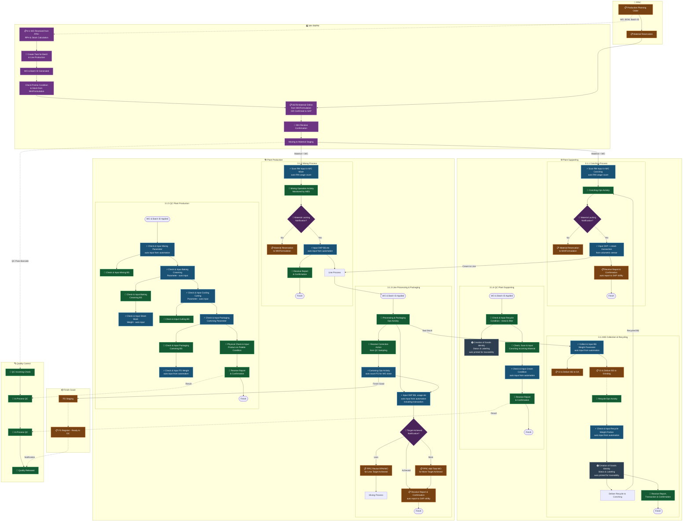

# Nabati MES Ecosystem — Part A: Model Operasi To-Be

**Referensi URS:** Bagian 3 — Model Operasi To-Be
**Ruang Lingkup:** PT KSNI Plant Majalengka, Gedung A Sektor 8

---

## 3.1 Gambaran Umum

Model to-be menempatkan MES sebagai lapisan kontrol eksekusi shopfloor antara SAP (referensi perencanaan/transaksi) dan proses produksi fisik. Pendekatan ini tidak hanya berfokus pada digitalisasi formulir, tetapi juga penguatan eksekusi manufaktur melalui keterhubungan antara order, material, proses, quality record, pengambilan data, dan visibilitas operasional.

Lapisan integrasi utama:
- **SAP** → Work Order, BOM, Batch ID, Reservasi Material
- **MES** → Kontrol eksekusi, eBR/eWI, IPQC, pelacakan material, analytics OEE
- **IoT / OT Gateway / DAQ** → Pengambilan data otomatis dari mesin dan sensor
- **Barcode Scan** → Identifikasi material, validasi tipping, keterlacakan FG

### Legenda Diagram

| Simbol | Keterangan |
|:---|:---|
| ⚡ | Auto by MES + IoT sensor |
| 📋 | Transaksi SAP |
| 🔄 | Aktivitas yang dipantau MES |
| 📧 | Notifikasi sistem |
| 🖨️ | Auto printed / labeling |

---

### Diagram Alur End-to-End To-Be

> **Legenda alur:** Garis putus-putus (`-.->`) = alur informasi/data/notifikasi. Garis solid (`-->`) = pergerakan fisik material atau alur proses utama.

---

## 3.2 Kapabilitas Sistem To-Be per Area Proses

Bagian ini merangkum apa yang diperoleh sistem MES di setiap area proses sebagai hasil implementasi to-be.

---

### 3.2.1 Plant Supporting — Proses Conching

**Ringkasan To-Be:** WO diterima H-1 dari SAP ke MES. MES membuat batch ID dan task untuk line produksi. Operator scan input RM ke mesin conching; jumlah pemakaian otomatis tersimpan real-time. Output cream dengan sensor volumetrik auto-input ke line process. Kekurangan material memicu notifikasi MES dan reservasi SAP. Akhir shift: laporan otomatis dan konfirmasi SAP.

| ID | Kapabilitas Sistem |
|:---:|:---|
| **1** | Sistem dapat menerima Work Order beserta perhitungan RPH & Stock secara otomatis |
| **2** | Sistem dapat membuat Batch ID secara otomatis |
| **3** | Sistem memberikan notifikasi saat material kurang |
| **4** | Sistem mencatat pemakaian RM secara real-time melalui scan barcode |
| **5** | Sistem auto-capture transaksi cream via sensor volumetrik |
| **6** | Sistem membuat laporan shift dan konfirmasi otomatis ke SAP |

---

### 3.2.2 Plant Production — Proses Mixing

**Ringkasan To-Be:** Alur WO H-1 sama seperti Conching. MES membuat job per batch dan lini. Operator scan RM per hopper. Operasi mixing dipantau oleh MES. Auto input dari otomasi jika tersedia. Notifikasi kekurangan material memicu reservasi SAP. Konfirmasi shift dilaporkan otomatis.

| ID | Kapabilitas Sistem |
|:---:|:---|
| **1** | Sistem dapat menerima Work Order beserta perhitungan RPH & Stock secara otomatis |
| **2** | Sistem dapat membuat Batch ID secara otomatis |
| **3** | Sistem memberikan notifikasi saat material kurang |
| **4** | Sistem mencatat pemakaian RM per hopper secara real-time melalui scan barcode |
| **5** | Sistem memantau aktivitas operasi mixing secara real-time |
| **6** | Sistem auto-input OKP, BS, dll. dari otomasi |
| **7** | Sistem membuat laporan shift dan konfirmasi otomatis |

---

### 3.2.3 Plant Production — Line Processing & Packaging

**Ringkasan To-Be:** WO dan batch ID diterapkan di awal. Aktivitas operasi Processing & Packaging dicatat. Auto input dari otomasi (OKP, BS, pemakaian, transaksi). Operasi cartoning dengan auto hitung FG untuk penutupan WO. Notifikasi pencapaian target memicu tindakan PPIC. Laporan SAP otomatis akhir shift.

| ID | Kapabilitas Sistem |
|:---:|:---|
| **1** | Sistem menerapkan WO & Batch ID di awal proses |
| **2** | Sistem mencatat seluruh aktivitas operasi Processing & Packaging |
| **3** | Sistem auto-capture OKP, BS, pemakaian, dan transaksi dari otomasi |
| **4** | Sistem menerima dan mencatat tindakan koreksi dari QC sampling |
| **5** | Sistem auto-hitung FG di operasi cartoning untuk penutupan WO |
| **6** | Sistem memberikan notifikasi pencapaian target; Lebih → PPIC tambah WO; Kurang → PPIC revisi RPH |
| **7** | Sistem membuat laporan shift dan auto report ke SAP |

---

### 3.2.4 Plant Supporting — BS & Recycling

**Ringkasan To-Be:** WO dan batch ID diterapkan. Berat BS auto-ditangkap via IoT. Parameter recycle dicek dan diinput dengan auto input dari otomasi. Identitas barang, status, dan pelabelan oleh QC, dicetak otomatis untuk keterlacakan. Kirim recycle ke Conching dengan tautan MES.

| ID | Kapabilitas Sistem |
|:---:|:---|
| **1** | Sistem auto-capture berat BS dari timbangan IoT |
| **2** | Sistem mencatat GI BS ke GA dan ke grinding |
| **3** | Sistem auto-capture parameter recycle dari otomasi |
| **4** | Sistem mencetak label identitas barang otomatis untuk keterlacakan |
| **5** | Sistem menghubungkan recycle BS ke WO Conching penerima |
| **6** | Sistem membuat laporan transaksi & konfirmasi |

---

### 3.2.5 In Process Quality Control — Plant Production

**Ringkasan To-Be:** QC terhubung ke WO & batch ID. Semua checkpoint didigitalisasi di MES. Auto input dari otomasi jika tersedia (berat, sensor). Input manual untuk organoleptik dan pengecekan visual.

| ID | Kapabilitas Sistem |
|:---:|:---|
| **1** | Sistem auto-input parameter mixing dari otomasi |
| **2** | Sistem auto-input parameter baking & creaming dari otomasi |
| **3** | Sistem auto-input berat sheet book dari otomasi |
| **4** | Sistem auto-input parameter cooling & cutting dari otomasi |
| **5** | Sistem auto-input parameter packaging & cartoning dari otomasi |
| **6** | Sistem auto-input berat FG dari otomasi |
| **7** | Sistem mendukung input manual untuk pengecekan fisik produk di pallet |
| **8** | Sistem membuat laporan & konfirmasi QC |

| Checkpoint | Parameter | Metode Capture |
|:---|:---|:---|
| Mixing | Parameter mixing, BS | ⚡ Auto IoT + 🔄 manual |
| Baking & Creaming | Parameter baking/creaming, BS, berat sheet book | ⚡ Auto IoT + 🔄 manual |
| Cooling & Cutting | Parameter cooling/cutting, BS | ⚡ Auto IoT + 🔄 manual |
| Packaging | Parameter packaging/cartoning, BS | ⚡ Auto IoT + 🔄 manual |
| Cartoning | Parameter cartoning, BS | ⚡ Auto IoT + 🔄 manual |
| Sampel pallet | Pengecekan fisik, kondisi produk pada pallet | 🔄 Input manual |
| Berat FG | Berat FG per karton | ⚡ Auto (counter/timbangan) |

---

### 3.2.6 In Process Quality Control — Plant Supporting

| ID | Kapabilitas Sistem |
|:---:|:---|
| **1** | Sistem mencatat pengecekan kondisi recycle (metal & filter) |
| **2** | Sistem mencetak label identitas barang otomatis untuk keterlacakan |
| **3** | Sistem mendukung scan & input material incoming conching |
| **4** | Sistem auto-input kondisi cream dari otomasi |
| **5** | Sistem membuat laporan & konfirmasi |

| Checkpoint | Parameter | Metode Capture |
|:---|:---|:---|
| Kondisi BS recycle | Kondisi metal & filter | 🔄 Input manual |
| Incoming conching | Scan & input material incoming conching | 🔄 Manual + scan barcode |
| Kondisi cream | Kondisi cream auto input dari otomasi | ⚡ Auto dari IoT |
| Identitas barang | Status & pelabelan, dicetak otomatis untuk keterlacakan | 🖨️ Cetak otomatis MES |

---

### 3.2.7 Quality Control — Incoming WH RMPM *(Nabati Internal Development)*

> **Catatan:** Pengembangan sistem label dan aplikasi untuk area ini ditangani oleh tim internal Nabati. Ruang lingkup vendor terbatas pada kesiapan integrasi dan dukungan perangkat.

| ID | Kapabilitas Sistem |
|:---:|:---|
| **1** | Sistem mendukung input verifikasi DO dengan CoA & inspeksi |
| **2** | Sistem auto-input sampling & penimbangan material dari otomasi |
| **3** | Sistem mencetak label identitas barang, status & lot otomatis |
| **4** | Sistem mengirimkan notifikasi status kualitas material yang diterima WH RMPM |

---

## 3.3 Ringkasan Alur Data MES–SAP

| Alur Data | Arah | Keterangan |
|:---|:---:|:---|
| Production Plan / Work Order / Process Order | SAP → MES | Referensi perencanaan untuk eksekusi |
| Master Data & Referensi Recipe | SAP → MES | BOM, recipe, master material |
| Referensi Inventori / Saldo Stok | SAP → MES | Pengecekan ketersediaan material |
| Proposal Posting Pergerakan Material | MES → SAP | Proposal GI/GR dari MES |
| Notifikasi | MES → SAP | Pemicu reservasi material |
| Proposal Kesiapan & Reservasi Material | MES → SAP | Hasil validasi H-1 |
| Kebutuhan & Reservasi Material Dikonfirmasi | SAP → MES | Reservasi yang telah dikonfirmasi |
| Konfirmasi Produksi | MES → SAP | Aktual vs rencana akhir shift |
| Penerimaan FG & Referensi Pallet | MES → SAP | Posting GR FG |

---

*← Kembali ke [index.md](../index.md)*
